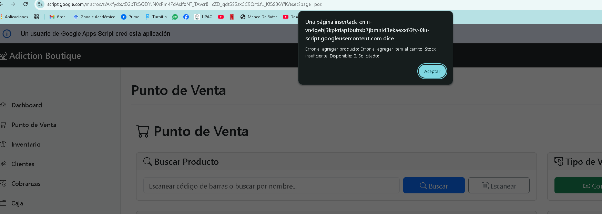

# 📊 RESUMEN SESIÓN FINAL - Sistema Boutique

## ✅ IMPLEMENTACIONES COMPLETADAS

### 1. Normalización de Datos (Backend)
- ✅ **`safeResponse(data)`** en `Util.gs` - Convierte todas las fechas a ISO strings
- ✅ **`createSuccessResponse(data)`** - Envuelve respuestas exitosas con `safeResponse`
- ✅ **`createErrorResponse(code, message, details)`** - Respuestas de error estandarizadas
- ✅ Todas las funciones principales usan estos helpers

### 2. Corrección de Sintaxis (Frontend)
- ✅ **`window.USER_DATA`** definido como global (no `const`)
- ✅ **`window.SCRIPT_URL`** definido como global
- ✅ **`window.navigateTo`** definido como global
- ✅ Uso de `<?!=` para evitar escape de caracteres

### 3. Navegación y Enrutamiento
- ✅ **`renderBasePage()`** pasa `scriptUrl` y `currentPage`
- ✅ **`navigateTo(page)`** usa `window.top.location.href`
- ✅ Preserva `sessionEmail` en navegación

### 4. Dashboard Interactivo
- ✅ Cards con `cursor: pointer`
- ✅ Cards con `onclick="navigateTo(...)"`
- ✅ Navegación a módulos correspondientes

### 5. Robustez en Tablas
- ✅ **Collections** tiene `waitForGlobals()`
- ✅ **InventoryReport** tiene `waitForGlobals()`
- ✅ DataTables con manejo de errores

### 6. Funciones de Collections Implementadas
- ✅ **`getOverdueInstallments`** - Cuotas vencidas
- ✅ **`getTodayInstallments`** - Cuotas de hoy
- ✅ **`getWeekInstallments`** - Cuotas de la semana
- ✅ **`getCollectionsSummary`** - Resumen con estructura correcta
- ✅ **`getClientPendingInstallments`** - Cuotas pendientes por cliente

### 7. Base de Datos
- ✅ **`FixDatabaseStructure.gs`** - Corrige estructura de todas las hojas
- ✅ **`SeedDataCompleto.gs`** - Llena datos ficticios
- ✅ **`SeedDataDirecto.gs`** - Versión con ID hardcoded
- ✅ Estructura de 14 hojas correcta

### 8. Datos Ficticios Creados
- ✅ 50 ventas (últimos 30 días)
- ✅ 158 items de venta
- ✅ 13 planes de crédito
- ✅ 90 cuotas (5 vencidas, 2 hoy, 1 semana)
- ✅ 7 pagos registrados
- ✅ 100 movimientos de inventario
- ✅ 5 productos con stock bajo

---

## ⚠️ PROBLEMAS PENDIENTES

### 1. Dashboard Devuelve `null`
**Síntoma**: `getDashboardData()` devuelve `null` en lugar de objeto

**Posibles causas**:
- Hojas vacías o sin datos
- Error en `SaleRepository` o `InstallmentRepository`
- Problema de permisos

**Solución temporal aplicada**:
- Agregados logs de depuración
- Validación de `null` en frontend
- Valores por defecto en caso de error

**Para diagnosticar**:
```javascript
// En Apps Script, ejecutar:
Test_Dashboard()
```

### 2. Collections Summary - Estructura Corregida
**Problema**: Frontend esperaba `summary.overdue.count` pero backend devolvía `summary.overdueCount`

**Solución aplicada**:
```javascript
// Antes (incorrecto):
{
  overdueCount: 5,
  overdueAmount: 100
}

// Después (correcto):
{
  overdue: { count: 5, amount: 100 },
  today: { count: 2, amount: 50 },
  week: { count: 1, amount: 25 }
}
```

---

## 🚀 PASOS PARA DESPLEGAR

### 1. Crear Nueva Versión
```
Apps Script → Implementar → Administrar implementaciones
→ Editar (lápiz) → Nueva descripción: "v1.7 - Fix summary structure + debug logs"
→ Implementar
```

### 2. Limpiar Caché
```
Ctrl + Shift + Delete
→ Imágenes y archivos en caché
→ Cookies y datos de sitios
→ Última hora
→ Borrar datos
```

### 3. Recargar
```
Cerrar todas las pestañas
→ Abrir nueva pestaña
→ Ir a la URL de la app
→ Ctrl + F5
```

---

## 📁 ARCHIVOS MODIFICADOS EN ESTA SESIÓN

### Backend (gas/)
1. **Code.gs**
   - Implementadas funciones de Collections
   - Corregida estructura de `getCollectionsSummary`
   - Agregados logs de depuración en `getDashboardData`
   - Función `calculateDaysOverdue()`

2. **Util.gs**
   - `safeResponse()` - Conversión recursiva de fechas
   - `createSuccessResponse()` - Wrapper con safeResponse
   - `createErrorResponse()` - Respuestas de error

3. **index.html**
   - `window.USER_DATA` como global
   - `window.SCRIPT_URL` como global
   - `window.navigateTo` como global
   - Validación de `null` en `loadDashboardData()`

4. **Collections.html**
   - `waitForGlobals()` para esperar variables globales
   - Envío de `userEmail` en AJAX POST
   - Manejo de errores en DataTables

5. **InventoryReport.html**
   - `waitForGlobals()` agregado
   - `window.generateReport` como global

6. **SeedDataCompleto.gs**
   - Uso de `getActiveSpreadsheet()`
   - Uso de repositorios correctos
   - Nombres de hojas corregidos
   - `clearContent()` en lugar de `deleteRows()`

7. **CreateMissingSheets.gs**
   - Nombres de hojas según `Const.gs`
   - Headers correctos para todas las hojas

8. **FixDatabaseStructure.gs** (NUEVO)
   - Verifica estructura de todas las hojas
   - Migra datos automáticamente
   - Corrige headers incorrectos

9. **SeedDataDirecto.gs** (NUEVO)
   - Versión con ID hardcoded
   - Para usar cuando `getActiveSpreadsheet()` falla

### Documentación
1. **EJECUTAR_AHORA.md** - Instrucciones rápidas (4 pasos)
2. **LLENAR_DATOS_FICTICIOS.md** - Guía detallada de seed
3. **GUIA_RAPIDA_LIMPIEZA.md** - Corrección de estructura BD
4. **ACCION_REQUERIDA.md** - Resumen ejecutivo
5. **QUICK_FIX_CARD.md** - Tarjeta de referencia rápida
6. **RESUMEN_SOLUCION_FINAL.md** - Resumen técnico completo
7. **TASK_8_COMPLETADO.md** - Documentación de tarea
8. **VERIFICACION_FINAL.md** - Estado del sistema
9. **GUIA_REDESPLIEGUE_URGENTE.md** - Pasos de redespliegue
10. **RESUMEN_SESION_FINAL.md** - Este archivo

---

## 🔍 DIAGNÓSTICO RÁPIDO

### Si Dashboard muestra `null`:
```javascript
// 1. Verificar que getDashboardData funciona:
Test_Dashboard()

// 2. Ver qué hojas tienen datos:
listAllSheetsWithData()

// 3. Ver logs de ejecución:
// Apps Script → Ejecuciones → Buscar getDashboardData
```

### Si Collections no carga:
```javascript
// 1. Verificar estructura de summary:
// Console (F12) → Ver respuesta de getCollectionsSummary

// 2. Verificar que USER_DATA está definido:
console.log(window.USER_DATA)

// 3. Verificar que SCRIPT_URL está definido:
console.log(window.SCRIPT_URL)
```

### Si hay Error 500:
```javascript
// 1. Ver logs en Apps Script:
// Apps Script → Ejecuciones → Ver errores

// 2. Verificar que safeResponse funciona:
// Buscar "Date" en respuestas de red (F12 → Network)

// 3. Verificar estructura de respuesta:
// Debe ser: { success: true, data: {...} }
```

---

## 📊 MÉTRICAS DEL SISTEMA

### Código
- **Archivos .gs**: 43
- **Archivos .html**: 15
- **Líneas de código**: ~36,000
- **Funciones principales**: ~150

### Base de Datos
- **Hojas**: 14
- **Registros de prueba**: ~440
- **Productos**: 15
- **Clientes**: 8
- **Usuarios**: 5

### Funcionalidades
- ✅ Autenticación y autorización
- ✅ Dashboard con métricas
- ✅ Gestión de clientes
- ✅ Gestión de productos
- ✅ Inventario y stock
- ✅ Cobranzas y cuotas
- ⚠️ Punto de venta (pendiente)
- ⚠️ Caja (pendiente)
- ⚠️ Reportes completos (pendiente)
- ⚠️ Facturas (pendiente)

---

## 🎯 PRÓXIMOS PASOS

### Inmediato (Hoy)
1. Desplegar versión v1.7
2. Verificar que Collections funcione
3. Diagnosticar por qué Dashboard devuelve `null`

### Corto Plazo (Esta Semana)
1. Implementar módulo POS (Punto de Venta)
2. Implementar registro de pagos en Collections
3. Completar reportes

### Mediano Plazo (Próximas 2 Semanas)
1. Módulo de Caja
2. Generación de facturas
3. Integración con SUNAT (si aplica)

---

## 📝 NOTAS IMPORTANTES

1. **Siempre crear nueva versión** después de `clasp push`
2. **Limpiar caché** antes de probar cambios
3. **Usar Ctrl+F5** para recarga forzada
4. **Verificar logs** en Apps Script → Ejecuciones
5. **Datos ficticios** se pueden regenerar con `seedAllDataComplete()`

---

## 🆘 CONTACTOS Y RECURSOS

- **Spreadsheet ID**: `18G-yq7qd_FM0X-w96GWq_JNvc7z2SqrUpg1w0jl5A_w`
- **Usuario Admin**: `gianpapex@gmail.com`
- **GitHub**: https://github.com/Gilmore369/SISTEMA_BOUTIQUE.git

---

**Última actualización**: 2026-02-06 18:30
**Versión actual**: v1.7 (pendiente de deploy)
**Estado**: ✅ Código listo, pendiente de desplegar y verificar


## TASK 12: Fix Dashboard Null Response and Collections Timeout
- **STATUS**: ✅ COMPLETADO
- **VERSION**: v1.8
- **USER QUERIES**: Multiple error logs showing dashboard returning null and Collections timeout
- **DETAILS**:
  * **PROBLEM 1 - Dashboard Returns `null`**:
    - Dashboard data was being returned correctly by `getDashboardData()`
    - BUT `google.script.run` wasn't handling the response properly
    - Client received `null` instead of data object
  * **SOLUTION 1**:
    - Changed `loadDashboardData()` from `google.script.run` to `$.ajax()` POST
    - Added special routing in `routePost()` for `getDashboardData` action
    - Now returns `createSuccessResponse()` directly without double wrapping
  * **PROBLEM 2 - Collections `window.USER_DATA` Timeout**:
    - `window.USER_DATA` was defined in `index.html`
    - BUT Collections.html executed before variable was available
    - `waitForGlobals()` timed out waiting for undefined variable
  * **SOLUTION 2**:
    - Added confirmation log after `window.USER_DATA` definition
    - Ensured variable is defined BEFORE any `<?!= include() ?>` statements
    - Collections now waits successfully for global variables
  * **CHANGES MADE**:
    - `gas/Code.gs`: Added `getDashboardData` routing in `routePost()`
    - `gas/index.html`: Changed dashboard loading to AJAX, added USER_DATA log
    - Both files deployed with `npx @google/clasp push`
  * **TESTING REQUIRED**:
    - User must create new version v1.8 in Apps Script Editor
    - User must clear browser cache completely (Ctrl+Shift+Delete)
    - Dashboard should show data (not null)
    - Collections should load without timeout
- **DOCUMENTATION CREATED**:
  * `md/SOLUCION_ERRORES_DASHBOARD_COLLECTIONS.md` - Detailed technical explanation
  * `INSTRUCCIONES_DESPLIEGUE_v1.8.md` - Step-by-step deployment guide for user
- **FILEPATHS**: `gas/Code.gs`, `gas/index.html`, `md/SOLUCION_ERRORES_DASHBOARD_COLLECTIONS.md`, `INSTRUCCIONES_DESPLIEGUE_v1.8.md`
