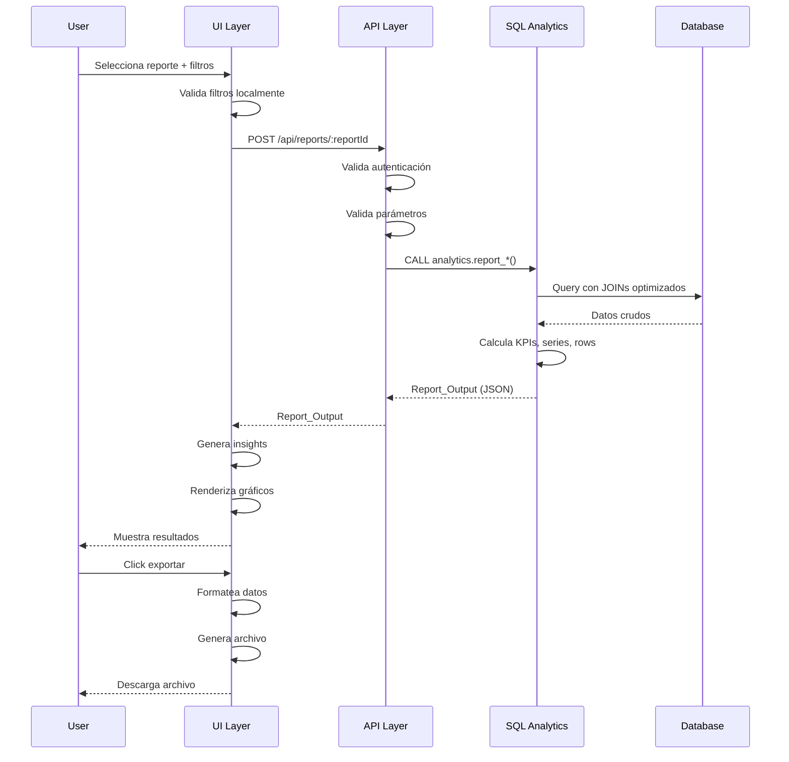
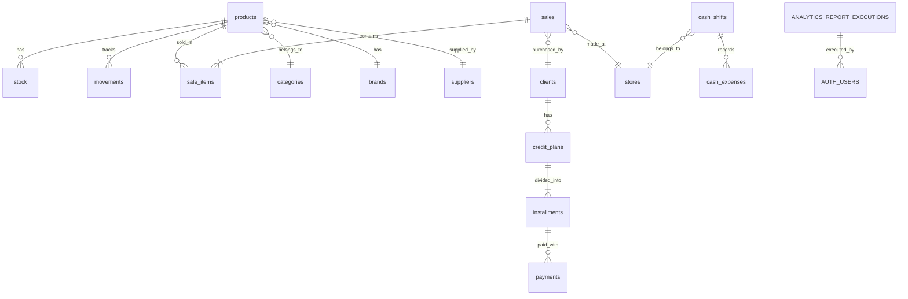

# Design Document: Analytics Reports Module

## Overview

El módulo Analytics Reports es un sistema completo de Business Intelligence para un sistema retail multi-tienda construido con Next.js, TypeScript y Supabase/Postgres. Proporciona análisis empresariales en tiempo real sobre inventario, ventas, compras, clientes y finanzas con capacidades avanzadas de visualización, filtrado y exportación.

### Objetivos del Sistema

- Proporcionar reportes empresariales en tiempo real con alto rendimiento
- Ofrecer análisis de datos en 5 categorías: Inventario, Ventas, Compras, Clientes y Financiero
- Permitir filtrado flexible por fecha, tienda, almacén, categoría, producto, marca y proveedor
- Visualizar datos mediante gráficos interactivos y tablas detalladas
- Exportar reportes en formatos CSV, Excel y PDF
- Generar insights automáticos basados en reglas de negocio
- Garantizar cálculos precisos sin valores N/A mediante técnicas anti-división-por-cero

### Alcance

El sistema cubre 15+ tipos de reportes organizados en 5 categorías:

**Inventario**: Rotación de Stock, Valorización, Stock Bajo, Kardex
**Ventas**: Timeline, Por Mes, Por Producto, Por Categoría, Crédito vs Contado, Resumen, Por Tienda
**Compras**: Por Proveedor, Por Período
**Clientes**: Con Deuda, Cuotas Vencidas, Efectividad de Cobranza
**Financiero**: Margen de Ganancia, Flujo de Caja


## Architecture

El sistema sigue una arquitectura de 4 capas claramente separadas:

```mermaid
graph TB
    subgraph "UI Layer - Next.js Client"
        A[ReportSelector] --> B[FilterPanel]
        B --> C[ReportViewer]
        C --> D[KPICards]
        C --> E[ChartRenderer]
        C --> F[DataTable]
        C --> G[ExportButtons]
    end
    
    subgraph "API Layer - Next.js Route Handlers"
        H[/api/reports/:reportId]
        I[Validation]
        J[Authentication]
        K[Error Handling]
        H --> I
        H --> J
        H --> K
    end
    
    subgraph "SQL Analytics Layer - Postgres"
        L[analytics schema]
        M[RPC Functions]
        N[Materialized Views]
        O[Indexes]
        L --> M
        L --> N
        L --> O
    end
    
    subgraph "Data Layer - Supabase"
        P[(products)]
        Q[(stock)]
        R[(movements)]
        S[(sales)]
        T[(sale_items)]
        U[(clients)]
        V[(credit_plans)]
        W[(installments)]
        X[(payments)]
        Y[(cash_shifts)]
        Z[(cash_expenses)]
    end
    
    G --> AA[Export Layer]
    AA --> AB[CSV Generator]
    AA --> AC[Excel Generator]
    AA --> AD[PDF Generator]
    
    A -.-> H
    H -.-> M
    M -.-> P
    M -.-> Q
    M -.-> R
    M -.-> S
    M -.-> T
    M -.-> U
    M -.-> V
    M -.-> W
    M -.-> X
    M -.-> Y
    M -.-> Z

```

### Flujo de Datos



### Principios de Diseño

1. **Separation of Concerns**: Cada capa tiene responsabilidades claramente definidas
2. **Performance First**: Cálculos pesados en SQL, UI solo renderiza
3. **Type Safety**: TypeScript end-to-end con interfaces compartidas
4. **Consistent Output**: Todos los reportes retornan la misma estructura Report_Output
5. **Zero N/A Policy**: Uso obligatorio de NULLIF/COALESCE en todas las divisiones
6. **Responsive Design**: UI adaptable desde 320px hasta 2560px
7. **Internationalization**: Todo en español con formato local (DD/MM/YYYY, coma decimal)

## Components and Interfaces

### Core Data Structures

#### Report_Output Structure

Estructura unificada que retornan todas las funciones RPC:

```typescript
interface Report_Output {
  kpis: KPI[]
  series: Series[]
  rows: Row[]
  meta: Meta
}

interface KPI {
  label: string
  value: number
  format: 'number' | 'currency' | 'percent' | 'decimal'
}

interface Series {
  name: string
  points: Point[]
}

interface Point {
  x: string  // Puede ser fecha, categoría, nombre de producto
  y: number
}

type Row = Record<string, any>  // Estructura flexible según el reporte

interface Meta {
  columns: Column[]
}

interface Column {
  key: string
  label: string
  type: 'string' | 'number' | 'currency' | 'percent' | 'decimal' | 'date'
}
```


#### Filter_Set Structure

```typescript
interface ReportFilters {
  startDate?: string      // ISO 8601 format
  endDate?: string        // ISO 8601 format
  storeId?: string        // UUID o código de tienda
  warehouseId?: string    // UUID o código de almacén
  categoryId?: string     // UUID
  productId?: string      // UUID
  brandId?: string        // UUID
  supplierId?: string     // UUID
  minStock?: number       // Para reporte de stock bajo
}
```

#### Report Configuration

```typescript
interface ReportConfig {
  id: ReportTypeId
  name: string
  description: string
  category: 'inventory' | 'sales' | 'purchases' | 'clients' | 'financial'
  rpcFunction: string
  availableFilters: Array<keyof ReportFilters>
  defaultFilters?: Partial<ReportFilters>
}

type ReportTypeId = 
  | 'inventory-rotation'
  | 'inventory-valuation'
  | 'low-stock'
  | 'kardex'
  | 'sales-timeline'
  | 'sales-by-month'
  | 'sales-by-product'
  | 'sales-by-category'
  | 'credit-vs-cash'
  | 'sales-summary'
  | 'sales-by-store'
  | 'purchases-by-supplier'
  | 'purchases-by-period'
  | 'clients-debt'
  | 'overdue-installments'
  | 'collection-effectiveness'
  | 'profit-margin'
  | 'cash-flow'
```


### SQL Analytics Layer

#### Schema Structure

```sql
CREATE SCHEMA IF NOT EXISTS analytics;

-- Tabla de log de ejecuciones
CREATE TABLE IF NOT EXISTS analytics.report_executions (
  id UUID PRIMARY KEY DEFAULT gen_random_uuid(),
  report_id TEXT NOT NULL,
  user_id UUID REFERENCES auth.users(id),
  filters JSONB,
  execution_time_ms INTEGER,
  created_at TIMESTAMPTZ DEFAULT NOW(),
  error_message TEXT
);

-- Índices para performance
CREATE INDEX idx_report_executions_report_id ON analytics.report_executions(report_id);
CREATE INDEX idx_report_executions_user_id ON analytics.report_executions(user_id);
CREATE INDEX idx_report_executions_created_at ON analytics.report_executions(created_at);
```

#### RPC Function Template

Todas las funciones RPC siguen este patrón:

```sql
CREATE OR REPLACE FUNCTION analytics.report_<name>(filters jsonb DEFAULT '{}'::jsonb)
RETURNS jsonb
LANGUAGE plpgsql
SECURITY DEFINER
AS $$
DECLARE
  result jsonb;
  start_date timestamptz;
  end_date timestamptz;
  store_filter text;
  warehouse_filter text;
  -- Más variables según necesidad
BEGIN
  -- 1. Extraer y validar filtros
  start_date := COALESCE((filters->>'start_date')::timestamptz, NOW() - INTERVAL '90 days');
  end_date := COALESCE((filters->>'end_date')::timestamptz, NOW());
  store_filter := filters->>'store_id';
  warehouse_filter := filters->>'warehouse_id';
  
  -- 2. Construir query con CTEs para claridad
  WITH data_source AS (
    -- Query principal con JOINs necesarios
    SELECT ...
    FROM ...
    WHERE ...
      AND (store_filter IS NULL OR store_id = store_filter)
      AND (warehouse_filter IS NULL OR warehouse_id = warehouse_filter)
  ),
  aggregated_data AS (
    -- Agregaciones y cálculos
    SELECT ...
    FROM data_source
    GROUP BY ...
  )
  -- 3. Construir Report_Output
  SELECT jsonb_build_object(
    'kpis', jsonb_build_array(
      jsonb_build_object('label', 'KPI 1', 'value', ..., 'format', 'currency'),
      jsonb_build_object('label', 'KPI 2', 'value', ..., 'format', 'number')
    ),
    'series', jsonb_build_array(
      jsonb_build_object(
        'name', 'Serie 1',
        'points', (
          SELECT jsonb_agg(jsonb_build_object('x', ..., 'y', ...))
          FROM aggregated_data
          LIMIT 20
        )
      )
    ),
    'rows', (
      SELECT jsonb_agg(
        jsonb_build_object(
          'field1', value1,
          'field2', value2,
          -- Usar COALESCE para evitar NULLs
          'calculated', COALESCE(ROUND(numerator / NULLIF(denominator, 0), 2), 0)
        )
      )
      FROM aggregated_data
    ),
    'meta', jsonb_build_object(
      'columns', jsonb_build_array(
        jsonb_build_object('key', 'field1', 'label', 'Campo 1', 'type', 'string'),
        jsonb_build_object('key', 'field2', 'label', 'Campo 2', 'type', 'currency')
      )
    )
  ) INTO result
  FROM aggregated_data;
  
  RETURN result;
END;
$$;
```


#### Key RPC Functions

##### 1. Rotación de Inventario

```sql
CREATE OR REPLACE FUNCTION analytics.report_inventory_rotation(filters jsonb DEFAULT '{}'::jsonb)
RETURNS jsonb
LANGUAGE plpgsql
SECURITY DEFINER
AS $$
DECLARE
  result jsonb;
  start_date timestamptz;
  end_date timestamptz;
  store_filter text;
  warehouse_filter text;
BEGIN
  start_date := COALESCE((filters->>'start_date')::timestamptz, NOW() - INTERVAL '90 days');
  end_date := COALESCE((filters->>'end_date')::timestamptz, NOW());
  store_filter := filters->>'store_id';
  warehouse_filter := filters->>'warehouse_id';

  WITH sales_data AS (
    SELECT 
      si.product_id,
      p.name,
      p.barcode,
      SUM(si.quantity) as total_sold,
      COUNT(DISTINCT s.id) as transactions
    FROM sale_items si
    INNER JOIN sales s ON si.sale_id = s.id
    INNER JOIN products p ON si.product_id = p.id
    WHERE s.voided = false
      AND s.created_at >= start_date
      AND s.created_at <= end_date
      AND (store_filter IS NULL OR s.store_id = store_filter)
    GROUP BY si.product_id, p.name, p.barcode
  ),
  stock_data AS (
    SELECT 
      product_id,
      SUM(quantity) as current_stock
    FROM stock
    WHERE (warehouse_filter IS NULL OR warehouse_id = warehouse_filter)
    GROUP BY product_id
  )
  SELECT jsonb_build_object(
    'kpis', jsonb_build_array(
      jsonb_build_object('label', 'Productos Analizados', 'value', COUNT(*), 'format', 'number'),
      jsonb_build_object('label', 'Total Vendido', 'value', SUM(sd.total_sold), 'format', 'number'),
      jsonb_build_object('label', 'Rotación Promedio', 'value', 
        COALESCE(ROUND(AVG(sd.total_sold / NULLIF(st.current_stock, 0)), 2), 0), 'format', 'decimal')
    ),
    'series', jsonb_build_array(
      jsonb_build_object(
        'name', 'Rotación por Producto',
        'points', (
          SELECT jsonb_agg(jsonb_build_object('x', name, 'y', 
            COALESCE(ROUND(total_sold / NULLIF(current_stock, 0), 2), 0)))
          FROM (
            SELECT sd.name, sd.total_sold, COALESCE(st.current_stock, 0) as current_stock
            FROM sales_data sd
            LEFT JOIN stock_data st ON sd.product_id = st.product_id
            ORDER BY sd.total_sold DESC
            LIMIT 20
          ) top_products
        )
      )
    ),
    'rows', (
      SELECT jsonb_agg(
        jsonb_build_object(
          'barcode', sd.barcode,
          'name', sd.name,
          'totalSold', sd.total_sold,
          'currentStock', COALESCE(st.current_stock, 0),
          'rotation', COALESCE(ROUND(sd.total_sold / NULLIF(st.current_stock, 0), 2), 0),
          'daysInventory', COALESCE(ROUND(365.0 / NULLIF(sd.total_sold / NULLIF(st.current_stock, 0), 0), 0), 0),
          'transactions', sd.transactions
        )
      )
      FROM sales_data sd
      LEFT JOIN stock_data st ON sd.product_id = st.product_id
      ORDER BY sd.total_sold DESC
    ),
    'meta', jsonb_build_object(
      'columns', jsonb_build_array(
        jsonb_build_object('key', 'barcode', 'label', 'Código', 'type', 'string'),
        jsonb_build_object('key', 'name', 'label', 'Producto', 'type', 'string'),
        jsonb_build_object('key', 'totalSold', 'label', 'Vendidos', 'type', 'number'),
        jsonb_build_object('key', 'currentStock', 'label', 'Stock Actual', 'type', 'number'),
        jsonb_build_object('key', 'rotation', 'label', 'Rotación', 'type', 'decimal'),
        jsonb_build_object('key', 'daysInventory', 'label', 'Días Inventario', 'type', 'number'),
        jsonb_build_object('key', 'transactions', 'label', 'Transacciones', 'type', 'number')
      )
    )
  ) INTO result
  FROM sales_data sd
  LEFT JOIN stock_data st ON sd.product_id = st.product_id;

  RETURN result;
END;
$$;
```


##### 2. Margen de Ganancia

```sql
CREATE OR REPLACE FUNCTION analytics.report_profit_margin(filters jsonb DEFAULT '{}'::jsonb)
RETURNS jsonb
LANGUAGE plpgsql
SECURITY DEFINER
AS $$
DECLARE
  result jsonb;
  start_date timestamptz;
  end_date timestamptz;
  store_filter text;
BEGIN
  start_date := COALESCE((filters->>'start_date')::timestamptz, DATE_TRUNC('month', NOW()));
  end_date := COALESCE((filters->>'end_date')::timestamptz, NOW());
  store_filter := filters->>'store_id';

  WITH margin_data AS (
    SELECT 
      p.id,
      p.barcode,
      p.name,
      COALESCE(c.name, 'Sin categoría') as category,
      SUM(si.quantity) as quantity_sold,
      ROUND(SUM(si.subtotal), 2) as revenue,
      ROUND(SUM(si.quantity * COALESCE(p.purchase_price, 0)), 2) as cogs,
      ROUND(SUM(si.subtotal) - SUM(si.quantity * COALESCE(p.purchase_price, 0)), 2) as profit,
      COALESCE(
        ROUND(
          (SUM(si.subtotal) - SUM(si.quantity * COALESCE(p.purchase_price, 0))) 
          / NULLIF(SUM(si.subtotal), 0) * 100, 
          2
        ), 
        0
      ) as margin_percent
    FROM sale_items si
    INNER JOIN sales s ON si.sale_id = s.id
    INNER JOIN products p ON si.product_id = p.id
    LEFT JOIN categories c ON p.category_id = c.id
    WHERE s.voided = false
      AND s.created_at >= start_date
      AND s.created_at <= end_date
      AND (store_filter IS NULL OR s.store_id = store_filter)
    GROUP BY p.id, p.barcode, p.name, c.name
  )
  SELECT jsonb_build_object(
    'kpis', jsonb_build_array(
      jsonb_build_object('label', 'Ingresos Totales', 'value', COALESCE(SUM(revenue), 0), 'format', 'currency'),
      jsonb_build_object('label', 'Costo Total', 'value', COALESCE(SUM(cogs), 0), 'format', 'currency'),
      jsonb_build_object('label', 'Ganancia Total', 'value', COALESCE(SUM(profit), 0), 'format', 'currency'),
      jsonb_build_object('label', 'Margen Promedio', 'value', COALESCE(ROUND(AVG(margin_percent), 2), 0), 'format', 'percent')
    ),
    'series', jsonb_build_array(
      jsonb_build_object(
        'name', 'Margen por Producto (Top 20)',
        'points', (
          SELECT jsonb_agg(jsonb_build_object('x', name, 'y', margin_percent))
          FROM (
            SELECT name, margin_percent
            FROM margin_data
            ORDER BY profit DESC
            LIMIT 20
          ) top_margin
        )
      )
    ),
    'rows', (
      SELECT jsonb_agg(
        jsonb_build_object(
          'barcode', barcode,
          'name', name,
          'category', category,
          'quantitySold', quantity_sold,
          'revenue', revenue,
          'cogs', cogs,
          'profit', profit,
          'marginPercent', margin_percent
        )
      )
      FROM margin_data
      ORDER BY profit DESC
    ),
    'meta', jsonb_build_object(
      'columns', jsonb_build_array(
        jsonb_build_object('key', 'barcode', 'label', 'Código', 'type', 'string'),
        jsonb_build_object('key', 'name', 'label', 'Producto', 'type', 'string'),
        jsonb_build_object('key', 'category', 'label', 'Categoría', 'type', 'string'),
        jsonb_build_object('key', 'revenue', 'label', 'Ingresos', 'type', 'currency'),
        jsonb_build_object('key', 'cogs', 'label', 'Costo', 'type', 'currency'),
        jsonb_build_object('key', 'profit', 'label', 'Ganancia', 'type', 'currency'),
        jsonb_build_object('key', 'marginPercent', 'label', 'Margen %', 'type', 'percent')
      )
    )
  ) INTO result
  FROM margin_data;

  RETURN result;
END;
$$;
```


##### 3. Flujo de Caja

```sql
CREATE OR REPLACE FUNCTION analytics.report_cash_flow(filters jsonb DEFAULT '{}'::jsonb)
RETURNS jsonb
LANGUAGE plpgsql
SECURITY DEFINER
AS $$
DECLARE
  result jsonb;
  start_date timestamptz;
  end_date timestamptz;
  store_filter text;
BEGIN
  start_date := COALESCE((filters->>'start_date')::timestamptz, DATE_TRUNC('month', NOW()));
  end_date := COALESCE((filters->>'end_date')::timestamptz, NOW());
  store_filter := filters->>'store_id';

  WITH cash_inflows AS (
    SELECT 
      TO_CHAR(created_at, 'YYYY-MM-DD') as date,
      'Ventas Contado' as concept,
      ROUND(SUM(total), 2) as amount
    FROM sales
    WHERE voided = false
      AND sale_type = 'CONTADO'
      AND created_at >= start_date
      AND created_at <= end_date
      AND (store_filter IS NULL OR store_id = store_filter)
    GROUP BY TO_CHAR(created_at, 'YYYY-MM-DD')
    
    UNION ALL
    
    SELECT 
      TO_CHAR(p.created_at, 'YYYY-MM-DD') as date,
      'Pagos Crédito' as concept,
      ROUND(SUM(p.amount), 2) as amount
    FROM payments p
    WHERE p.created_at >= start_date
      AND p.created_at <= end_date
    GROUP BY TO_CHAR(p.created_at, 'YYYY-MM-DD')
  ),
  cash_outflows AS (
    SELECT 
      TO_CHAR(ce.created_at, 'YYYY-MM-DD') as date,
      'Gastos' as concept,
      ROUND(SUM(ce.amount), 2) as amount
    FROM cash_expenses ce
    INNER JOIN cash_shifts cs ON ce.shift_id = cs.id
    WHERE ce.created_at >= start_date
      AND ce.created_at <= end_date
      AND (store_filter IS NULL OR cs.store_id = store_filter)
    GROUP BY TO_CHAR(ce.created_at, 'YYYY-MM-DD')
  ),
  combined_flow AS (
    SELECT date, concept, amount, 'INGRESO' as type FROM cash_inflows
    UNION ALL
    SELECT date, concept, -amount as amount, 'EGRESO' as type FROM cash_outflows
  )
  SELECT jsonb_build_object(
    'kpis', jsonb_build_array(
      jsonb_build_object('label', 'Total Ingresos', 'value', 
        COALESCE((SELECT SUM(amount) FROM cash_inflows), 0), 'format', 'currency'),
      jsonb_build_object('label', 'Total Egresos', 'value', 
        COALESCE((SELECT SUM(amount) FROM cash_outflows), 0), 'format', 'currency'),
      jsonb_build_object('label', 'Flujo Neto', 'value', 
        COALESCE((SELECT SUM(amount) FROM cash_inflows), 0) - 
        COALESCE((SELECT SUM(amount) FROM cash_outflows), 0), 'format', 'currency')
    ),
    'series', jsonb_build_array(
      jsonb_build_object(
        'name', 'Flujo Diario',
        'points', (
          SELECT jsonb_agg(jsonb_build_object('x', date, 'y', daily_flow))
          FROM (
            SELECT 
              date,
              ROUND(SUM(amount), 2) as daily_flow
            FROM combined_flow
            GROUP BY date
            ORDER BY date
          ) daily_data
        )
      )
    ),
    'rows', (
      SELECT jsonb_agg(
        jsonb_build_object(
          'date', date,
          'concept', concept,
          'type', type,
          'amount', ABS(amount)
        )
      )
      FROM combined_flow
      ORDER BY date DESC, type
    ),
    'meta', jsonb_build_object(
      'columns', jsonb_build_array(
        jsonb_build_object('key', 'date', 'label', 'Fecha', 'type', 'date'),
        jsonb_build_object('key', 'concept', 'label', 'Concepto', 'type', 'string'),
        jsonb_build_object('key', 'type', 'label', 'Tipo', 'type', 'string'),
        jsonb_build_object('key', 'amount', 'label', 'Monto', 'type', 'currency')
      )
    )
  ) INTO result;

  RETURN result;
END;
$$;
```


#### Performance Optimization

##### Índices Recomendados

```sql
-- Índices en sales
CREATE INDEX IF NOT EXISTS idx_sales_created_at ON sales(created_at) WHERE voided = false;
CREATE INDEX IF NOT EXISTS idx_sales_store_id ON sales(store_id) WHERE voided = false;
CREATE INDEX IF NOT EXISTS idx_sales_sale_type ON sales(sale_type) WHERE voided = false;
CREATE INDEX IF NOT EXISTS idx_sales_composite ON sales(created_at, store_id, sale_type) WHERE voided = false;

-- Índices en sale_items
CREATE INDEX IF NOT EXISTS idx_sale_items_product_id ON sale_items(product_id);
CREATE INDEX IF NOT EXISTS idx_sale_items_sale_id ON sale_items(sale_id);

-- Índices en stock
CREATE INDEX IF NOT EXISTS idx_stock_product_id ON stock(product_id);
CREATE INDEX IF NOT EXISTS idx_stock_warehouse_id ON stock(warehouse_id);
CREATE INDEX IF NOT EXISTS idx_stock_composite ON stock(product_id, warehouse_id);

-- Índices en movements
CREATE INDEX IF NOT EXISTS idx_movements_created_at ON movements(created_at);
CREATE INDEX IF NOT EXISTS idx_movements_product_id ON movements(product_id);
CREATE INDEX IF NOT EXISTS idx_movements_type ON movements(type);
CREATE INDEX IF NOT EXISTS idx_movements_composite ON movements(created_at, product_id, type);

-- Índices en installments
CREATE INDEX IF NOT EXISTS idx_installments_status ON installments(status);
CREATE INDEX IF NOT EXISTS idx_installments_due_date ON installments(due_date);
CREATE INDEX IF NOT EXISTS idx_installments_plan_id ON installments(plan_id);

-- Índices en payments
CREATE INDEX IF NOT EXISTS idx_payments_created_at ON payments(created_at);
CREATE INDEX IF NOT EXISTS idx_payments_installment_id ON payments(installment_id);

-- Índices en cash_expenses
CREATE INDEX IF NOT EXISTS idx_cash_expenses_created_at ON cash_expenses(created_at);
CREATE INDEX IF NOT EXISTS idx_cash_expenses_shift_id ON cash_expenses(shift_id);
```

##### Vistas Materializadas (Opcional para queries pesadas)

```sql
-- Vista materializada para ventas agregadas por día
CREATE MATERIALIZED VIEW IF NOT EXISTS analytics.mv_daily_sales AS
SELECT 
  DATE_TRUNC('day', created_at) as sale_date,
  store_id,
  sale_type,
  COUNT(*) as sale_count,
  SUM(total) as total_revenue,
  AVG(total) as avg_ticket
FROM sales
WHERE voided = false
GROUP BY DATE_TRUNC('day', created_at), store_id, sale_type;

CREATE UNIQUE INDEX ON analytics.mv_daily_sales(sale_date, store_id, sale_type);

-- Refrescar automáticamente cada hora
CREATE OR REPLACE FUNCTION analytics.refresh_materialized_views()
RETURNS void
LANGUAGE plpgsql
AS $$
BEGIN
  REFRESH MATERIALIZED VIEW CONCURRENTLY analytics.mv_daily_sales;
END;
$$;

-- Programar con pg_cron (si está disponible)
-- SELECT cron.schedule('refresh-analytics-views', '0 * * * *', 'SELECT analytics.refresh_materialized_views()');
```


### API Layer

#### Route Handler Structure

```typescript
// app/api/reports/[reportId]/route.ts
import { NextRequest, NextResponse } from 'next/server'
import { createServerClient } from '@/lib/supabase/server'
import { ReportFilters, ReportTypeId } from '@/lib/reports/report-types'
import { z } from 'zod'

// Validación de filtros con Zod
const FiltersSchema = z.object({
  startDate: z.string().datetime().optional(),
  endDate: z.string().datetime().optional(),
  storeId: z.string().uuid().optional(),
  warehouseId: z.string().uuid().optional(),
  categoryId: z.string().uuid().optional(),
  productId: z.string().uuid().optional(),
  brandId: z.string().uuid().optional(),
  supplierId: z.string().uuid().optional(),
  minStock: z.number().int().positive().optional()
})

export async function POST(
  request: NextRequest,
  { params }: { params: { reportId: string } }
) {
  const startTime = Date.now()
  
  try {
    // 1. Autenticación
    const supabase = await createServerClient()
    const { data: { user }, error: authError } = await supabase.auth.getUser()
    
    if (authError || !user) {
      return NextResponse.json(
        { error: 'Authentication required' },
        { status: 401 }
      )
    }
    
    // 2. Validar reportId
    const reportId = params.reportId as ReportTypeId
    const validReportIds = [
      'inventory-rotation',
      'inventory-valuation',
      'low-stock',
      'kardex',
      'sales-timeline',
      'sales-by-month',
      'sales-by-product',
      'sales-by-category',
      'credit-vs-cash',
      'sales-summary',
      'sales-by-store',
      'purchases-by-supplier',
      'purchases-by-period',
      'clients-debt',
      'overdue-installments',
      'collection-effectiveness',
      'profit-margin',
      'cash-flow'
    ]
    
    if (!validReportIds.includes(reportId)) {
      return NextResponse.json(
        { error: 'Invalid report ID' },
        { status: 400 }
      )
    }
    
    // 3. Parsear y validar filtros
    const body = await request.json()
    const filtersResult = FiltersSchema.safeParse(body.filters || {})
    
    if (!filtersResult.success) {
      return NextResponse.json(
        { error: 'Invalid filters', details: filtersResult.error.issues },
        { status: 400 }
      )
    }
    
    const filters = filtersResult.data
    
    // 4. Validar rango de fechas
    if (filters.startDate && filters.endDate) {
      const start = new Date(filters.startDate)
      const end = new Date(filters.endDate)
      
      if (start > end) {
        return NextResponse.json(
          { error: 'Start date must be before end date' },
          { status: 400 }
        )
      }
    }
    
    // 5. Convertir reportId a nombre de función RPC
    const rpcName = `report_${reportId.replace(/-/g, '_')}`
    
    // 6. Preparar filtros en formato JSONB
    const jsonFilters = {
      start_date: filters.startDate,
      end_date: filters.endDate,
      store_id: filters.storeId,
      warehouse_id: filters.warehouseId,
      category_id: filters.categoryId,
      product_id: filters.productId,
      brand_id: filters.brandId,
      supplier_id: filters.supplierId,
      min_stock: filters.minStock
    }
    
    // 7. Llamar función RPC
    const { data, error } = await supabase.rpc(rpcName as any, { 
      filters: jsonFilters 
    } as any)
    
    if (error) {
      console.error('RPC Error:', error)
      
      // Log error en tabla de ejecuciones
      await supabase.from('analytics.report_executions').insert({
        report_id: reportId,
        user_id: user.id,
        filters: jsonFilters,
        execution_time_ms: Date.now() - startTime,
        error_message: error.message
      })
      
      return NextResponse.json(
        { error: 'Database error', details: error.message },
        { status: 500 }
      )
    }
    
    // 8. Log ejecución exitosa
    const executionTime = Date.now() - startTime
    
    await supabase.from('analytics.report_executions').insert({
      report_id: reportId,
      user_id: user.id,
      filters: jsonFilters,
      execution_time_ms: executionTime
    })
    
    // 9. Retornar resultado con headers de cache
    return NextResponse.json(data, {
      status: 200,
      headers: {
        'Cache-Control': 'private, max-age=300', // 5 minutos
        'X-Execution-Time': executionTime.toString()
      }
    })
    
  } catch (error) {
    console.error('Unexpected error:', error)
    return NextResponse.json(
      { error: 'Internal server error' },
      { status: 500 }
    )
  }
}
```


### UI Layer

#### Component Architecture

```
components/reports/
├── ReportSelector.tsx          # Selector de reportes por categoría
├── FilterPanel.tsx             # Panel de filtros dinámicos
├── ReportViewer.tsx            # Contenedor principal de resultados
├── KPICards.tsx                # Tarjetas de KPIs
├── ChartRenderer.tsx           # Renderizador de gráficos (Recharts)
├── DataTable.tsx               # Tabla de datos con paginación
├── ExportButtons.tsx           # Botones de exportación
├── InsightsPanel.tsx           # Panel de insights automáticos
└── DateRangePresets.tsx        # Botones de rangos predefinidos
```

#### ReportSelector Component

```typescript
// components/reports/ReportSelector.tsx
'use client'

import { useState } from 'react'
import { Select, SelectContent, SelectItem, SelectTrigger, SelectValue, SelectGroup, SelectLabel } from '@/components/ui/select'
import { ReportConfig, ReportTypeId } from '@/lib/reports/report-types'

interface ReportSelectorProps {
  onReportSelect: (reportId: ReportTypeId) => void
  selectedReport: ReportTypeId | null
}

const REPORT_CATEGORIES = {
  inventory: {
    name: '📦 Inventario',
    reports: [
      { id: 'inventory-rotation', name: 'Rotación de Stock', description: 'Análisis de rotación de inventario' },
      { id: 'inventory-valuation', name: 'Valorización', description: 'Valor del inventario actual' },
      { id: 'low-stock', name: 'Stock Bajo', description: 'Productos con stock bajo o agotado' },
      { id: 'kardex', name: 'Kardex', description: 'Historial de movimientos de inventario' }
    ]
  },
  sales: {
    name: '💰 Ventas',
    reports: [
      { id: 'sales-timeline', name: 'Timeline de Ventas', description: 'Ventas a lo largo del tiempo' },
      { id: 'sales-by-month', name: 'Por Mes', description: 'Ventas agrupadas por mes' },
      { id: 'sales-by-product', name: 'Por Producto', description: 'Ventas por producto' },
      { id: 'sales-by-category', name: 'Por Categoría', description: 'Ventas por categoría' },
      { id: 'credit-vs-cash', name: 'Crédito vs Contado', description: 'Comparación de tipos de venta' },
      { id: 'sales-summary', name: 'Resumen', description: 'Resumen general de ventas' },
      { id: 'sales-by-store', name: 'Por Tienda', description: 'Ventas por tienda' }
    ]
  },
  purchases: {
    name: '🛒 Compras',
    reports: [
      { id: 'purchases-by-supplier', name: 'Por Proveedor', description: 'Compras por proveedor' },
      { id: 'purchases-by-period', name: 'Por Período', description: 'Compras en período de tiempo' }
    ]
  },
  clients: {
    name: '👥 Clientes',
    reports: [
      { id: 'clients-debt', name: 'Con Deuda', description: 'Clientes con saldo pendiente' },
      { id: 'overdue-installments', name: 'Cuotas Vencidas', description: 'Cuotas vencidas por cobrar' },
      { id: 'collection-effectiveness', name: 'Efectividad de Cobranza', description: 'Análisis de cobranza' }
    ]
  },
  financial: {
    name: '💵 Financiero',
    reports: [
      { id: 'profit-margin', name: 'Margen de Ganancia', description: 'Análisis de márgenes' },
      { id: 'cash-flow', name: 'Flujo de Caja', description: 'Ingresos y egresos' }
    ]
  }
}

export function ReportSelector({ onReportSelect, selectedReport }: ReportSelectorProps) {
  return (
    <div className="space-y-2">
      <label className="text-sm font-medium">Seleccionar Reporte</label>
      <Select
        value={selectedReport || ''}
        onValueChange={(value) => onReportSelect(value as ReportTypeId)}
      >
        <SelectTrigger>
          <SelectValue placeholder="Selecciona un reporte..." />
        </SelectTrigger>
        <SelectContent>
          {Object.entries(REPORT_CATEGORIES).map(([category, { name, reports }]) => (
            <SelectGroup key={category}>
              <SelectLabel>{name}</SelectLabel>
              {reports.map((report) => (
                <SelectItem key={report.id} value={report.id}>
                  {report.name}
                </SelectItem>
              ))}
            </SelectGroup>
          ))}
        </SelectContent>
      </Select>
      {selectedReport && (
        <p className="text-xs text-gray-600">
          {REPORT_CATEGORIES[
            Object.keys(REPORT_CATEGORIES).find(cat => 
              REPORT_CATEGORIES[cat as keyof typeof REPORT_CATEGORIES].reports.some(r => r.id === selectedReport)
            ) as keyof typeof REPORT_CATEGORIES
          ]?.reports.find(r => r.id === selectedReport)?.description}
        </p>
      )}
    </div>
  )
}
```


#### FilterPanel Component

```typescript
// components/reports/FilterPanel.tsx
'use client'

import { useState } from 'react'
import { Input } from '@/components/ui/input'
import { Label } from '@/components/ui/label'
import { Select, SelectContent, SelectItem, SelectTrigger, SelectValue } from '@/components/ui/select'
import { Button } from '@/components/ui/button'
import { ReportFilters } from '@/lib/reports/report-types'
import { Calendar, X } from 'lucide-react'

interface FilterPanelProps {
  filters: ReportFilters
  onFiltersChange: (filters: ReportFilters) => void
  availableFilters: Array<keyof ReportFilters>
}

export function FilterPanel({ filters, onFiltersChange, availableFilters }: FilterPanelProps) {
  const handleFilterChange = (key: keyof ReportFilters, value: any) => {
    onFiltersChange({ ...filters, [key]: value })
  }
  
  const handleClearFilters = () => {
    onFiltersChange({
      startDate: new Date(new Date().getFullYear(), new Date().getMonth(), 1).toISOString().split('T')[0],
      endDate: new Date().toISOString().split('T')[0]
    })
  }
  
  const setDatePreset = (preset: 'today' | 'week' | 'month' | 'year') => {
    const now = new Date()
    let startDate: Date
    let endDate = now
    
    switch (preset) {
      case 'today':
        startDate = now
        break
      case 'week':
        startDate = new Date(now.getFullYear(), now.getMonth(), now.getDate() - now.getDay())
        break
      case 'month':
        startDate = new Date(now.getFullYear(), now.getMonth(), 1)
        break
      case 'year':
        startDate = new Date(now.getFullYear(), 0, 1)
        break
    }
    
    onFiltersChange({
      ...filters,
      startDate: startDate.toISOString().split('T')[0],
      endDate: endDate.toISOString().split('T')[0]
    })
  }
  
  return (
    <div className="space-y-4 p-4 border rounded-lg bg-gray-50">
      <div className="flex items-center justify-between">
        <h3 className="font-semibold text-sm">Filtros</h3>
        <Button variant="ghost" size="sm" onClick={handleClearFilters}>
          <X className="h-4 w-4 mr-1" />
          Limpiar
        </Button>
      </div>
      
      {/* Date Range Presets */}
      {(availableFilters.includes('startDate') || availableFilters.includes('endDate')) && (
        <div className="space-y-2">
          <Label className="text-xs">Rango Rápido</Label>
          <div className="grid grid-cols-4 gap-2">
            <Button variant="outline" size="sm" onClick={() => setDatePreset('today')}>
              Hoy
            </Button>
            <Button variant="outline" size="sm" onClick={() => setDatePreset('week')}>
              Semana
            </Button>
            <Button variant="outline" size="sm" onClick={() => setDatePreset('month')}>
              Mes
            </Button>
            <Button variant="outline" size="sm" onClick={() => setDatePreset('year')}>
              Año
            </Button>
          </div>
        </div>
      )}
      
      <div className="grid grid-cols-1 md:grid-cols-2 lg:grid-cols-3 gap-3">
        {/* Start Date */}
        {availableFilters.includes('startDate') && (
          <div>
            <Label className="text-xs">Fecha Inicio</Label>
            <Input
              type="date"
              value={filters.startDate || ''}
              onChange={(e) => handleFilterChange('startDate', e.target.value)}
              className="h-9 text-sm"
            />
          </div>
        )}
        
        {/* End Date */}
        {availableFilters.includes('endDate') && (
          <div>
            <Label className="text-xs">Fecha Fin</Label>
            <Input
              type="date"
              value={filters.endDate || ''}
              onChange={(e) => handleFilterChange('endDate', e.target.value)}
              className="h-9 text-sm"
            />
          </div>
        )}
        
        {/* Store */}
        {availableFilters.includes('storeId') && (
          <div>
            <Label className="text-xs">Tienda</Label>
            <Select
              value={filters.storeId || 'all'}
              onValueChange={(value) => handleFilterChange('storeId', value === 'all' ? undefined : value)}
            >
              <SelectTrigger className="h-9 text-sm">
                <SelectValue />
              </SelectTrigger>
              <SelectContent>
                <SelectItem value="all">Todas las Tiendas</SelectItem>
                <SelectItem value="TIENDA_HOMBRES">Tienda Hombres</SelectItem>
                <SelectItem value="TIENDA_MUJERES">Tienda Mujeres</SelectItem>
              </SelectContent>
            </Select>
          </div>
        )}
        
        {/* Warehouse */}
        {availableFilters.includes('warehouseId') && (
          <div>
            <Label className="text-xs">Almacén</Label>
            <Select
              value={filters.warehouseId || 'all'}
              onValueChange={(value) => handleFilterChange('warehouseId', value === 'all' ? undefined : value)}
            >
              <SelectTrigger className="h-9 text-sm">
                <SelectValue />
              </SelectTrigger>
              <SelectContent>
                <SelectItem value="all">Todos los Almacenes</SelectItem>
                {/* Cargar dinámicamente desde DB */}
              </SelectContent>
            </Select>
          </div>
        )}
        
        {/* Min Stock */}
        {availableFilters.includes('minStock') && (
          <div>
            <Label className="text-xs">Stock Mínimo</Label>
            <Input
              type="number"
              value={filters.minStock || 5}
              onChange={(e) => handleFilterChange('minStock', parseInt(e.target.value))}
              className="h-9 text-sm"
              min="0"
            />
          </div>
        )}
      </div>
    </div>
  )
}
```


#### ChartRenderer Component

```typescript
// components/reports/ChartRenderer.tsx
'use client'

import { LineChart, Line, BarChart, Bar, PieChart, Pie, Cell, XAxis, YAxis, CartesianGrid, Tooltip, Legend, ResponsiveContainer } from 'recharts'
import { Series } from '@/lib/reports/report-types'

interface ChartRendererProps {
  series: Series[]
  chartType?: 'line' | 'bar' | 'pie'
}

const COLORS = ['#1a1a1a', '#d4a574', '#8b7355', '#c9a87c', '#6b5d52']

export function ChartRenderer({ series, chartType = 'bar' }: ChartRendererProps) {
  if (!series || series.length === 0) {
    return (
      <div className="flex items-center justify-center h-64 text-gray-500">
        No hay datos para visualizar
      </div>
    )
  }
  
  // Transformar datos para Recharts
  const chartData = series[0].points.map((point, idx) => {
    const dataPoint: any = { name: point.x }
    series.forEach((s) => {
      dataPoint[s.name] = s.points[idx]?.y || 0
    })
    return dataPoint
  })
  
  const formatValue = (value: number) => {
    return value.toLocaleString('es-PE', {
      minimumFractionDigits: 0,
      maximumFractionDigits: 2
    })
  }
  
  const formatCurrency = (value: number) => {
    return `S/ ${value.toLocaleString('es-PE', {
      minimumFractionDigits: 2,
      maximumFractionDigits: 2
    })}`
  }
  
  if (chartType === 'line') {
    return (
      <ResponsiveContainer width="100%" height={400}>
        <LineChart data={chartData}>
          <CartesianGrid strokeDasharray="3 3" />
          <XAxis 
            dataKey="name" 
            angle={-45}
            textAnchor="end"
            height={100}
            style={{ fontSize: '12px' }}
          />
          <YAxis 
            tickFormatter={formatValue}
            style={{ fontSize: '12px' }}
          />
          <Tooltip 
            formatter={formatCurrency}
            contentStyle={{ fontSize: '12px' }}
          />
          <Legend />
          {series.map((s, idx) => (
            <Line 
              key={s.name}
              type="monotone" 
              dataKey={s.name} 
              stroke={COLORS[idx % COLORS.length]}
              strokeWidth={2}
            />
          ))}
        </LineChart>
      </ResponsiveContainer>
    )
  }
  
  if (chartType === 'pie') {
    return (
      <ResponsiveContainer width="100%" height={400}>
        <PieChart>
          <Pie
            data={chartData}
            cx="50%"
            cy="50%"
            labelLine={false}
            label={({ name, percent }) => `${name}: ${(percent * 100).toFixed(1)}%`}
            outerRadius={120}
            fill="#8884d8"
            dataKey={series[0].name}
          >
            {chartData.map((entry, index) => (
              <Cell key={`cell-${index}`} fill={COLORS[index % COLORS.length]} />
            ))}
          </Pie>
          <Tooltip formatter={formatCurrency} />
        </PieChart>
      </ResponsiveContainer>
    )
  }
  
  // Default: Bar Chart
  return (
    <ResponsiveContainer width="100%" height={400}>
      <BarChart data={chartData}>
        <CartesianGrid strokeDasharray="3 3" />
        <XAxis 
          dataKey="name" 
          angle={-45}
          textAnchor="end"
          height={100}
          style={{ fontSize: '12px' }}
        />
        <YAxis 
          tickFormatter={formatValue}
          style={{ fontSize: '12px' }}
        />
        <Tooltip 
          formatter={formatCurrency}
          contentStyle={{ fontSize: '12px' }}
        />
        <Legend />
        {series.map((s, idx) => (
          <Bar 
            key={s.name}
            dataKey={s.name} 
            fill={COLORS[idx % COLORS.length]}
          />
        ))}
      </BarChart>
    </ResponsiveContainer>
  )
}
```


### Export Layer

#### Export Utilities

```typescript
// lib/reports/export-utils.ts
import * as XLSX from 'xlsx'
import { jsPDF } from 'jspdf'
import autoTable from 'jspdf-autotable'
import Papa from 'papaparse'

export type ExportFormat = 'csv' | 'excel' | 'pdf'

interface ExportOptions {
  filename: string
  title: string
  headers: string[]
  data: any[][]
  format: ExportFormat
  kpis?: Array<{ label: string; value: number; format: string }>
}

/**
 * Exportar a CSV con BOM para Excel
 */
export function exportToCSV(options: ExportOptions) {
  const { filename, headers, data } = options
  
  const csv = Papa.unparse({
    fields: headers,
    data: data
  })
  
  // Agregar BOM para que Excel reconozca UTF-8
  const blob = new Blob(['\uFEFF' + csv], { type: 'text/csv;charset=utf-8;' })
  downloadBlob(blob, `${filename}.csv`)
}

/**
 * Exportar a Excel con formato
 */
export function exportToExcel(options: ExportOptions) {
  const { filename, title, headers, data, kpis } = options
  
  const workbook = XLSX.utils.book_new()
  
  // Construir hoja con título y KPIs
  const sheetData: any[][] = []
  
  // Título
  sheetData.push([title])
  sheetData.push([`Generado: ${new Date().toLocaleString('es-PE')}`])
  sheetData.push([])
  
  // KPIs si existen
  if (kpis && kpis.length > 0) {
    sheetData.push(['INDICADORES CLAVE'])
    kpis.forEach(kpi => {
      const formattedValue = formatValue(kpi.value, kpi.format)
      sheetData.push([kpi.label, formattedValue])
    })
    sheetData.push([])
  }
  
  // Headers y datos
  sheetData.push(headers)
  sheetData.push(...data)
  
  const worksheet = XLSX.utils.aoa_to_sheet(sheetData)
  
  // Aplicar anchos de columna
  const colWidths = headers.map(() => ({ wch: 18 }))
  worksheet['!cols'] = colWidths
  
  XLSX.utils.book_append_sheet(workbook, worksheet, 'Reporte')
  XLSX.writeFile(workbook, `${filename}.xlsx`)
}

/**
 * Exportar a PDF con formato profesional
 */
export function exportToPDF(options: ExportOptions) {
  const { filename, title, headers, data, kpis } = options
  
  const doc = new jsPDF('l', 'mm', 'a4')
  
  // Título
  doc.setFontSize(18)
  doc.setTextColor(26, 26, 26)
  doc.text(title, 14, 15)
  
  // Fecha
  doc.setFontSize(10)
  doc.setTextColor(100, 100, 100)
  doc.text(`Generado: ${new Date().toLocaleString('es-PE')}`, 14, 22)
  
  // Línea separadora
  doc.setDrawColor(212, 165, 116)
  doc.setLineWidth(0.5)
  doc.line(14, 25, 283, 25)
  
  let startY = 30
  
  // KPIs si existen
  if (kpis && kpis.length > 0) {
    doc.setFontSize(12)
    doc.setTextColor(26, 26, 26)
    doc.text('Indicadores Clave', 14, startY)
    startY += 7
    
    doc.setFontSize(9)
    kpis.forEach((kpi, idx) => {
      const formattedValue = formatValue(kpi.value, kpi.format)
      doc.text(`${kpi.label}: ${formattedValue}`, 14, startY + (idx * 5))
    })
    startY += (kpis.length * 5) + 5
  }
  
  // Tabla
  autoTable(doc, {
    head: [headers],
    body: data,
    startY: startY,
    styles: { 
      fontSize: 7,
      cellPadding: 1.5,
      overflow: 'linebreak',
      halign: 'left'
    },
    headStyles: { 
      fillColor: [26, 26, 26],
      textColor: [212, 165, 116],
      fontStyle: 'bold',
      halign: 'center',
      fontSize: 8
    },
    alternateRowStyles: {
      fillColor: [245, 245, 245]
    },
    margin: { top: 30, right: 14, bottom: 20, left: 14 },
    didDrawPage: (data) => {
      const pageCount = (doc as any).internal.getNumberOfPages()
      const currentPage = (doc as any).internal.getCurrentPageInfo().pageNumber
      
      doc.setFontSize(8)
      doc.setTextColor(150, 150, 150)
      doc.text(
        `Página ${currentPage} de ${pageCount}`,
        doc.internal.pageSize.getWidth() / 2,
        doc.internal.pageSize.getHeight() - 10,
        { align: 'center' }
      )
    }
  })
  
  doc.save(`${filename}.pdf`)
}

/**
 * Formatear valores según tipo
 */
function formatValue(value: number, format: string): string {
  switch (format) {
    case 'currency':
      return `S/ ${value.toLocaleString('es-PE', { minimumFractionDigits: 2, maximumFractionDigits: 2 })}`
    case 'percent':
      return `${value.toFixed(1)}%`
    case 'decimal':
      return value.toFixed(2)
    case 'number':
    default:
      return value.toLocaleString('es-PE', { minimumFractionDigits: 0, maximumFractionDigits: 0 })
  }
}

/**
 * Descargar blob
 */
function downloadBlob(blob: Blob, filename: string) {
  const url = window.URL.createObjectURL(blob)
  const link = document.createElement('a')
  link.href = url
  link.download = filename
  link.style.display = 'none'
  document.body.appendChild(link)
  link.click()
  
  setTimeout(() => {
    document.body.removeChild(link)
    window.URL.revokeObjectURL(url)
  }, 100)
}

/**
 * Función principal de exportación
 */
export function exportReport(options: ExportOptions) {
  switch (options.format) {
    case 'csv':
      exportToCSV(options)
      break
    case 'excel':
      exportToExcel(options)
      break
    case 'pdf':
      exportToPDF(options)
      break
    default:
      throw new Error(`Formato no soportado: ${options.format}`)
  }
}
```


### Insights Engine

#### Automatic Insights Generation

```typescript
// lib/reports/insights.ts

export interface Insight {
  type: 'info' | 'warning' | 'error' | 'success'
  title: string
  message: string
  severity: 'low' | 'medium' | 'high'
}

/**
 * Generar insights automáticos basados en reglas de negocio
 */
export function generateInsights(reportId: string, data: any[]): Insight[] {
  const insights: Insight[] = []
  
  switch (reportId) {
    case 'inventory-rotation':
      insights.push(...generateRotationInsights(data))
      break
    case 'low-stock':
      insights.push(...generateLowStockInsights(data))
      break
    case 'profit-margin':
      insights.push(...generateMarginInsights(data))
      break
    case 'clients-debt':
      insights.push(...generateDebtInsights(data))
      break
    case 'cash-flow':
      insights.push(...generateCashFlowInsights(data))
      break
    case 'overdue-installments':
      insights.push(...generateOverdueInsights(data))
      break
  }
  
  return insights
}

/**
 * Insights para rotación de inventario
 */
function generateRotationInsights(data: any[]): Insight[] {
  const insights: Insight[] = []
  
  // Productos con rotación baja (< 1)
  const slowMoving = data.filter(item => item.rotation < 1)
  if (slowMoving.length > 0) {
    insights.push({
      type: 'warning',
      title: 'Inventario de Movimiento Lento',
      message: `${slowMoving.length} productos tienen rotación menor a 1. Considera promociones o descuentos.`,
      severity: 'medium'
    })
  }
  
  // Productos con días de inventario > 180
  const excessInventory = data.filter(item => item.daysInventory > 180)
  if (excessInventory.length > 0) {
    insights.push({
      type: 'error',
      title: 'Inventario Excesivo',
      message: `${excessInventory.length} productos tienen más de 180 días de inventario. Riesgo de obsolescencia.`,
      severity: 'high'
    })
  }
  
  // Productos con alta rotación (> 10)
  const fastMoving = data.filter(item => item.rotation > 10)
  if (fastMoving.length > 0) {
    insights.push({
      type: 'success',
      title: 'Productos de Alta Rotación',
      message: `${fastMoving.length} productos tienen excelente rotación (>10). Asegura stock suficiente.`,
      severity: 'low'
    })
  }
  
  return insights
}

/**
 * Insights para stock bajo
 */
function generateLowStockInsights(data: any[]): Insight[] {
  const insights: Insight[] = []
  
  const outOfStock = data.filter(item => item.currentStock === 0)
  const lowStock = data.filter(item => item.currentStock > 0 && item.currentStock <= 5)
  
  if (outOfStock.length > 0) {
    insights.push({
      type: 'error',
      title: 'Productos Agotados',
      message: `${outOfStock.length} productos están completamente agotados. Reabastece urgentemente.`,
      severity: 'high'
    })
  }
  
  if (lowStock.length > 0) {
    insights.push({
      type: 'warning',
      title: 'Stock Bajo',
      message: `${lowStock.length} productos tienen stock bajo (≤5 unidades). Planifica reabastecimiento.`,
      severity: 'medium'
    })
  }
  
  return insights
}

/**
 * Insights para margen de ganancia
 */
function generateMarginInsights(data: any[]): Insight[] {
  const insights: Insight[] = []
  
  // Productos con margen bajo (< 20%)
  const lowMargin = data.filter(item => item.marginPercent < 20)
  if (lowMargin.length > 0) {
    insights.push({
      type: 'warning',
      title: 'Margen Bajo',
      message: `${lowMargin.length} productos tienen margen menor al 20%. Revisa precios o costos.`,
      severity: 'medium'
    })
  }
  
  // Productos con margen negativo
  const negativeMargin = data.filter(item => item.marginPercent < 0)
  if (negativeMargin.length > 0) {
    insights.push({
      type: 'error',
      title: 'Margen Negativo',
      message: `${negativeMargin.length} productos se venden con pérdida. Acción inmediata requerida.`,
      severity: 'high'
    })
  }
  
  // Productos con excelente margen (> 50%)
  const highMargin = data.filter(item => item.marginPercent > 50)
  if (highMargin.length > 0) {
    insights.push({
      type: 'success',
      title: 'Margen Excelente',
      message: `${highMargin.length} productos tienen margen superior al 50%. Productos estrella.`,
      severity: 'low'
    })
  }
  
  return insights
}

/**
 * Insights para deuda de clientes
 */
function generateDebtInsights(data: any[]): Insight[] {
  const insights: Insight[] = []
  
  // Clientes con utilización > 90%
  const highUtilization = data.filter(item => {
    const utilization = parseFloat(item.utilizationPercent)
    return utilization > 90
  })
  
  if (highUtilization.length > 0) {
    insights.push({
      type: 'warning',
      title: 'Límite de Crédito Cercano',
      message: `${highUtilization.length} clientes han usado más del 90% de su límite de crédito.`,
      severity: 'medium'
    })
  }
  
  // Clientes con cuotas vencidas
  const withOverdue = data.filter(item => item.overdueInstallments > 0)
  if (withOverdue.length > 0) {
    insights.push({
      type: 'error',
      title: 'Cuotas Vencidas',
      message: `${withOverdue.length} clientes tienen cuotas vencidas. Gestión de cobranza necesaria.`,
      severity: 'high'
    })
  }
  
  return insights
}

/**
 * Insights para flujo de caja
 */
function generateCashFlowInsights(data: any[]): Insight[] {
  const insights: Insight[] = []
  
  // Calcular flujo neto total
  const netFlow = data.reduce((sum, item) => {
    return sum + (item.type === 'INGRESO' ? item.amount : -item.amount)
  }, 0)
  
  if (netFlow < 0) {
    insights.push({
      type: 'error',
      title: 'Flujo de Caja Negativo',
      message: `El flujo neto es negativo (S/ ${netFlow.toFixed(2)}). Revisa gastos y estrategia de cobranza.`,
      severity: 'high'
    })
  } else if (netFlow > 0) {
    insights.push({
      type: 'success',
      title: 'Flujo de Caja Positivo',
      message: `El flujo neto es positivo (S/ ${netFlow.toFixed(2)}). Buena salud financiera.`,
      severity: 'low'
    })
  }
  
  return insights
}

/**
 * Insights para cuotas vencidas
 */
function generateOverdueInsights(data: any[]): Insight[] {
  const insights: Insight[] = []
  
  // Cuotas con más de 30 días de atraso
  const criticalOverdue = data.filter(item => item.daysOverdue > 30)
  if (criticalOverdue.length > 0) {
    insights.push({
      type: 'error',
      title: 'Atraso Crítico',
      message: `${criticalOverdue.length} cuotas tienen más de 30 días de atraso. Riesgo de incobrabilidad.`,
      severity: 'high'
    })
  }
  
  // Monto total vencido
  const totalOverdue = data.reduce((sum, item) => sum + item.pending, 0)
  if (totalOverdue > 10000) {
    insights.push({
      type: 'warning',
      title: 'Monto Vencido Alto',
      message: `El monto total vencido es S/ ${totalOverdue.toFixed(2)}. Intensifica gestión de cobranza.`,
      severity: 'high'
    })
  }
  
  return insights
}
```


## Data Models

### Database Schema Integration

El módulo de analytics se integra con el schema existente de la base de datos:



### Key Tables Used

#### products
```sql
CREATE TABLE products (
  id UUID PRIMARY KEY,
  name TEXT NOT NULL,
  barcode TEXT UNIQUE,
  purchase_price DECIMAL(10,2),
  price DECIMAL(10,2) NOT NULL,
  category_id UUID REFERENCES categories(id),
  brand_id UUID REFERENCES brands(id),
  supplier_id UUID REFERENCES suppliers(id),
  active BOOLEAN DEFAULT true,
  created_at TIMESTAMPTZ DEFAULT NOW()
);
```

#### stock
```sql
CREATE TABLE stock (
  id UUID PRIMARY KEY,
  product_id UUID REFERENCES products(id),
  warehouse_id UUID REFERENCES warehouses(id),
  quantity INTEGER NOT NULL DEFAULT 0,
  updated_at TIMESTAMPTZ DEFAULT NOW(),
  UNIQUE(product_id, warehouse_id)
);
```

#### sales
```sql
CREATE TABLE sales (
  id UUID PRIMARY KEY,
  sale_number TEXT UNIQUE NOT NULL,
  store_id TEXT NOT NULL,
  client_id UUID REFERENCES clients(id),
  sale_type TEXT CHECK (sale_type IN ('CONTADO', 'CREDITO')),
  payment_type TEXT,
  subtotal DECIMAL(10,2) NOT NULL,
  discount DECIMAL(10,2) DEFAULT 0,
  total DECIMAL(10,2) NOT NULL,
  voided BOOLEAN DEFAULT false,
  created_at TIMESTAMPTZ DEFAULT NOW()
);
```

#### sale_items
```sql
CREATE TABLE sale_items (
  id UUID PRIMARY KEY,
  sale_id UUID REFERENCES sales(id),
  product_id UUID REFERENCES products(id),
  quantity INTEGER NOT NULL,
  unit_price DECIMAL(10,2) NOT NULL,
  subtotal DECIMAL(10,2) NOT NULL,
  created_at TIMESTAMPTZ DEFAULT NOW()
);
```

#### movements
```sql
CREATE TABLE movements (
  id UUID PRIMARY KEY,
  product_id UUID REFERENCES products(id),
  warehouse_id UUID REFERENCES warehouses(id),
  type TEXT CHECK (type IN ('ENTRADA', 'SALIDA', 'AJUSTE')),
  quantity INTEGER NOT NULL,
  reference TEXT,
  notes TEXT,
  created_at TIMESTAMPTZ DEFAULT NOW()
);
```

#### clients
```sql
CREATE TABLE clients (
  id UUID PRIMARY KEY,
  name TEXT NOT NULL,
  phone TEXT,
  address TEXT,
  credit_limit DECIMAL(10,2) DEFAULT 0,
  credit_used DECIMAL(10,2) DEFAULT 0,
  active BOOLEAN DEFAULT true,
  created_at TIMESTAMPTZ DEFAULT NOW()
);
```

#### installments
```sql
CREATE TABLE installments (
  id UUID PRIMARY KEY,
  plan_id UUID REFERENCES credit_plans(id),
  installment_number INTEGER NOT NULL,
  amount DECIMAL(10,2) NOT NULL,
  paid_amount DECIMAL(10,2) DEFAULT 0,
  due_date DATE NOT NULL,
  status TEXT CHECK (status IN ('PENDING', 'PAID', 'OVERDUE')),
  created_at TIMESTAMPTZ DEFAULT NOW()
);
```

#### payments
```sql
CREATE TABLE payments (
  id UUID PRIMARY KEY,
  installment_id UUID REFERENCES installments(id),
  amount DECIMAL(10,2) NOT NULL,
  payment_method TEXT,
  notes TEXT,
  created_at TIMESTAMPTZ DEFAULT NOW()
);
```

#### cash_expenses
```sql
CREATE TABLE cash_expenses (
  id UUID PRIMARY KEY,
  shift_id UUID REFERENCES cash_shifts(id),
  amount DECIMAL(10,2) NOT NULL,
  category TEXT,
  description TEXT,
  created_at TIMESTAMPTZ DEFAULT NOW()
);
```


## Correctness Properties

*Una propiedad es una característica o comportamiento que debe ser verdadero en todas las ejecuciones válidas de un sistema - esencialmente, una declaración formal sobre lo que el sistema debe hacer. Las propiedades sirven como puente entre las especificaciones legibles por humanos y las garantías de corrección verificables por máquinas.*

### Acceptance Criteria Testing Prework

Análisis de testabilidad de los criterios de aceptación:

#### Requirement 1: SQL Analytics Layer

1.1. THE SQL_Analytics_Layer SHALL create a schema named `analytics` in Postgres
  Thoughts: Este es un requisito de configuración específico. Podemos verificar que el schema existe consultando pg_catalog.
  Testable: yes - example

1.2. THE SQL_Analytics_Layer SHALL implement RPC functions for each report type
  Thoughts: Este es un requisito estructural. Podemos verificar que todas las funciones RPC esperadas existen en el schema analytics.
  Testable: yes - example

1.3. WHEN an RPC function is called, THE SQL_Analytics_Layer SHALL return a Report_Output structure with kpis, series, rows and meta fields
  Thoughts: Esta es una regla que debe aplicarse a todas las funciones RPC. Para cualquier función RPC y cualquier conjunto de filtros válidos, el resultado debe tener estos 4 campos.
  Testable: yes - property

1.4. THE SQL_Analytics_Layer SHALL use NULLIF and COALESCE to prevent division by zero
  Thoughts: Este es un requisito de implementación. Podemos verificar el código SQL de las funciones para asegurar que todas las divisiones usan NULLIF.
  Testable: no (requiere inspección de código)

1.5. THE SQL_Analytics_Layer SHALL never return NULL values in numeric calculations
  Thoughts: Esta es una regla universal. Para cualquier función RPC y cualquier conjunto de filtros, ningún campo numérico en el resultado debe ser NULL.
  Testable: yes - property

1.6. THE SQL_Analytics_Layer SHALL accept Filter_Set parameters
  Thoughts: Esta es una regla sobre la firma de las funciones. Todas las funciones RPC deben aceptar un parámetro jsonb llamado filters.
  Testable: yes - example

1.7. THE SQL_Analytics_Layer SHALL apply appropriate indexes for query optimization
  Thoughts: Este es un requisito de performance. Podemos verificar que los índices existen, pero no podemos testear "apropiado" automáticamente.
  Testable: yes - example (verificar existencia de índices)

1.8. WHERE a report requires heavy computation, THE SQL_Analytics_Layer SHALL use materialized views
  Thoughts: Este es un requisito condicional de optimización. Es difícil definir "heavy computation" de manera testeable.
  Testable: no

#### Requirement 2: Inventory Reports

2.1. WHEN the rotation report is requested, THE Report_Engine SHALL calculate rotation as total_sold_qty divided by stock_final using NULLIF
  Thoughts: Esta es una regla de cálculo específica. Para cualquier conjunto de datos de ventas y stock, la rotación debe calcularse con esta fórmula.
  Testable: yes - property

2.2. WHEN the rotation report is requested, THE Report_Engine SHALL calculate days_inventory as 365 divided by rotation using NULLIF
  Thoughts: Esta es una regla de cálculo derivada. Para cualquier rotación calculada, days_inventory debe ser 365/rotation.
  Testable: yes - property

2.3. WHEN the valorization report is requested, THE Report_Engine SHALL calculate cost_value as stock_qty multiplied by cost_price
  Thoughts: Esta es una regla de cálculo. Para cualquier producto con stock, cost_value = stock_qty * cost_price.
  Testable: yes - property

2.4. WHEN the valorization report is requested, THE Report_Engine SHALL calculate sale_value as stock_qty multiplied by sale_price
  Thoughts: Similar al anterior, es una regla de cálculo universal.
  Testable: yes - property

2.5. WHEN the valorization report is requested, THE Report_Engine SHALL calculate potential_margin as sale_value minus cost_value
  Thoughts: Esta es una regla de cálculo derivada. potential_margin = sale_value - cost_value.
  Testable: yes - property

2.6. WHEN the low stock report is requested, THE Report_Engine SHALL identify products where stock_qty is less than min_stock
  Thoughts: Esta es una regla de filtrado. Todos los productos en el resultado deben tener stock_qty < min_stock.
  Testable: yes - property

2.7. WHEN the kardex report is requested, THE Report_Engine SHALL list all movements with running balance calculation
  Thoughts: Esta es una regla sobre el contenido del reporte. Cada movimiento debe tener un balance calculado.
  Testable: yes - property

2.8. THE Report_Engine SHALL order kardex movements by date ascending
  Thoughts: Esta es una regla de ordenamiento. Los movimientos deben estar ordenados cronológicamente.
  Testable: yes - property


#### Requirement 3: Sales Reports

3.1. WHEN a sales report is requested, THE Report_Engine SHALL calculate total_revenue from sales table
  Thoughts: Esta es una regla de agregación. Para cualquier conjunto de ventas, total_revenue debe ser la suma de los totales.
  Testable: yes - property

3.2. WHEN a sales report is requested, THE Report_Engine SHALL calculate total_cost from sale_items joined with products
  Thoughts: Esta es una regla de cálculo con JOIN. Para cualquier venta, el costo total debe ser la suma de (quantity * purchase_price).
  Testable: yes - property

3.3. WHEN a sales report is requested, THE Report_Engine SHALL calculate gross_margin as total_revenue minus total_cost
  Thoughts: Esta es una regla de cálculo derivada. gross_margin = total_revenue - total_cost.
  Testable: yes - property

3.4. WHEN a sales report is requested, THE Report_Engine SHALL calculate margin_pct as gross_margin divided by total_revenue using NULLIF
  Thoughts: Esta es una regla de cálculo de porcentaje. margin_pct = (gross_margin / total_revenue) * 100, usando NULLIF para evitar división por cero.
  Testable: yes - property

3.5. WHEN a sales report is requested, THE Report_Engine SHALL calculate avg_ticket as total_revenue divided by sale_count using NULLIF
  Thoughts: Esta es una regla de promedio. avg_ticket = total_revenue / sale_count.
  Testable: yes - property

3.6. WHEN sales by payment type is requested, THE Report_Engine SHALL group by payment_type field
  Thoughts: Esta es una regla de agrupación. Cada payment_type único debe aparecer una vez en el resultado.
  Testable: yes - property

3.7. WHEN sales by store is requested, THE Report_Engine SHALL group by store_id field
  Thoughts: Similar al anterior, es una regla de agrupación por store_id.
  Testable: yes - property

3.8. WHEN sales by product is requested, THE Report_Engine SHALL join sale_items with products table
  Thoughts: Esta es una regla de JOIN. Cada item debe tener información del producto asociado.
  Testable: yes - property

3.9. WHEN sales by category is requested, THE Report_Engine SHALL join products with categories table
  Thoughts: Esta es una regla de JOIN. Cada producto debe tener información de categoría.
  Testable: yes - property

#### Requirement 4: Purchase Reports

4.1. WHEN a purchase report is requested, THE Report_Engine SHALL query movements table where type equals 'ENTRADA'
  Thoughts: Esta es una regla de filtrado. Todos los movimientos en el resultado deben tener type = 'ENTRADA'.
  Testable: yes - property

4.2. WHEN a purchase report is requested, THE Report_Engine SHALL calculate total_quantity from movements
  Thoughts: Esta es una regla de agregación. total_quantity debe ser la suma de las cantidades.
  Testable: yes - property

4.3. WHEN a purchase report is requested, THE Report_Engine SHALL calculate total_cost as quantity multiplied by unit_cost
  Thoughts: Esta es una regla de cálculo. Para cada movimiento, total_cost = quantity * unit_cost.
  Testable: yes - property

4.4. WHEN purchases by supplier is requested, THE Report_Engine SHALL group by supplier_id field
  Thoughts: Esta es una regla de agrupación. Cada supplier_id único debe aparecer una vez.
  Testable: yes - property

4.5. WHEN purchases by period is requested, THE Report_Engine SHALL group by date ranges
  Thoughts: Esta es una regla de agrupación temporal. Los datos deben estar agrupados por períodos de tiempo.
  Testable: yes - property

#### Requirement 5: Client Reports

5.1. WHEN a client debt report is requested, THE Report_Engine SHALL calculate debt_balance as installments.amount minus paid_amount
  Thoughts: Esta es una regla de cálculo. Para cada cliente, debt_balance = sum(installments.amount) - sum(paid_amount).
  Testable: yes - property

5.2. WHEN a client debt report is requested, THE Report_Engine SHALL filter clients where debt_balance is greater than zero
  Thoughts: Esta es una regla de filtrado. Todos los clientes en el resultado deben tener debt_balance > 0.
  Testable: yes - property

5.3. WHEN an overdue installments report is requested, THE Report_Engine SHALL filter installments where due_date is less than current_date and status is not 'PAID'
  Thoughts: Esta es una regla de filtrado compuesta. Todas las cuotas deben estar vencidas y no pagadas.
  Testable: yes - property

5.4. WHEN a collection effectiveness report is requested, THE Report_Engine SHALL calculate collected_amount from payments table
  Thoughts: Esta es una regla de agregación. collected_amount debe ser la suma de los pagos.
  Testable: yes - property

5.5. WHEN a collection effectiveness report is requested, THE Report_Engine SHALL calculate expected_amount from installments table
  Thoughts: Esta es una regla de agregación. expected_amount debe ser la suma de las cuotas esperadas.
  Testable: yes - property

5.6. WHEN a collection effectiveness report is requested, THE Report_Engine SHALL calculate effectiveness_pct as collected_amount divided by expected_amount using NULLIF
  Thoughts: Esta es una regla de cálculo de porcentaje. effectiveness_pct = (collected_amount / expected_amount) * 100.
  Testable: yes - property


#### Requirement 6: Financial Reports

6.1. WHEN a profit margin report is requested, THE Report_Engine SHALL calculate revenue from sales table
  Thoughts: Esta es una regla de agregación. revenue debe ser la suma de los totales de ventas.
  Testable: yes - property

6.2. WHEN a profit margin report is requested, THE Report_Engine SHALL calculate cost from sale_items joined with products
  Thoughts: Esta es una regla de cálculo con JOIN. cost debe ser la suma de (quantity * purchase_price).
  Testable: yes - property

6.3. WHEN a profit margin report is requested, THE Report_Engine SHALL calculate gross_profit as revenue minus cost
  Thoughts: Esta es una regla de cálculo derivada. gross_profit = revenue - cost.
  Testable: yes - property

6.4. WHEN a profit margin report is requested, THE Report_Engine SHALL calculate margin_pct as gross_profit divided by revenue using NULLIF
  Thoughts: Esta es una regla de cálculo de porcentaje. margin_pct = (gross_profit / revenue) * 100.
  Testable: yes - property

6.5. WHEN a cash flow report is requested, THE Report_Engine SHALL calculate income from sales and payments tables
  Thoughts: Esta es una regla de agregación multi-tabla. income debe ser la suma de ventas contado + pagos de crédito.
  Testable: yes - property

6.6. WHEN a cash flow report is requested, THE Report_Engine SHALL calculate expenses from cash_expenses table
  Thoughts: Esta es una regla de agregación. expenses debe ser la suma de los gastos.
  Testable: yes - property

6.7. WHEN a cash flow report is requested, THE Report_Engine SHALL calculate net_cash_flow as income minus expenses
  Thoughts: Esta es una regla de cálculo derivada. net_cash_flow = income - expenses.
  Testable: yes - property

#### Requirement 12: Report Output Structure

12.1. THE Report_Engine SHALL return Report_Output with four fields: kpis, series, rows and meta
  Thoughts: Esta es una regla estructural. Para cualquier reporte, el resultado debe tener exactamente estos 4 campos.
  Testable: yes - property

12.2. THE Report_Output.kpis field SHALL be an array of objects with label and value properties
  Thoughts: Esta es una regla de estructura de datos. Cada KPI debe tener label y value.
  Testable: yes - property

12.3. THE Report_Output.series field SHALL be an array of objects with name and points properties
  Thoughts: Esta es una regla de estructura de datos. Cada serie debe tener name y points.
  Testable: yes - property

12.4. THE Report_Output.series.points field SHALL be an array of objects with x and y properties
  Thoughts: Esta es una regla de estructura de datos anidada. Cada punto debe tener x e y.
  Testable: yes - property

12.5. THE Report_Output.rows field SHALL be an array of objects representing tabular data
  Thoughts: Esta es una regla de tipo de datos. rows debe ser un array de objetos.
  Testable: yes - property

12.6. THE Report_Output.meta field SHALL contain a columns array with key, label and type properties
  Thoughts: Esta es una regla de estructura de metadatos. Cada columna debe tener key, label y type.
  Testable: yes - property

12.7. THE Report_Output SHALL use consistent property names across all report types
  Thoughts: Esta es una regla de consistencia. Los nombres de propiedades deben seguir convenciones (camelCase).
  Testable: yes - property

12.8. THE Report_Output SHALL format dates as ISO 8601 strings
  Thoughts: Esta es una regla de formato. Todas las fechas deben estar en formato ISO 8601.
  Testable: yes - property

#### Requirement 20: Numeric Formatting Standards

20.1. THE Analytics_Module SHALL never display "N/A" or NULL in numeric fields
  Thoughts: Esta es una regla universal. Para cualquier reporte, ningún campo numérico debe ser NULL o "N/A".
  Testable: yes - property

20.2. WHEN a division by zero would occur, THE SQL_Analytics_Layer SHALL use NULLIF in the denominator
  Thoughts: Este es un requisito de implementación. Requiere inspección de código SQL.
  Testable: no (requiere inspección de código)

20.3. WHEN a NULL result would occur, THE SQL_Analytics_Layer SHALL use COALESCE to provide a default value of 0
  Thoughts: Este es un requisito de implementación. Requiere inspección de código SQL.
  Testable: no (requiere inspección de código)

20.4. THE UI_Layer SHALL format currency values with 2 decimal places
  Thoughts: Esta es una regla de formato UI. Todos los valores de moneda deben tener 2 decimales.
  Testable: yes - property

20.5. THE UI_Layer SHALL format percentage values with 1 decimal place
  Thoughts: Esta es una regla de formato UI. Todos los porcentajes deben tener 1 decimal.
  Testable: yes - property

20.6. THE UI_Layer SHALL format quantity values with 0 decimal places
  Thoughts: Esta es una regla de formato UI. Las cantidades deben ser enteros.
  Testable: yes - property

20.7. THE UI_Layer SHALL format decimal metrics with 2 decimal places
  Thoughts: Esta es una regla de formato UI. Las métricas decimales deben tener 2 decimales.
  Testable: yes - property

20.8. THE UI_Layer SHALL use thousand separators for numbers greater than 999
  Thoughts: Esta es una regla de formato UI. Los números grandes deben tener separadores de miles.
  Testable: yes - property


### Property Reflection

Revisando todas las propiedades identificadas para eliminar redundancias:

**Redundancias Identificadas:**

1. **Cálculos de margen**: Los requisitos 3.3-3.4 (Sales) y 6.3-6.4 (Financial) calculan lo mismo (gross_margin y margin_pct). Podemos consolidar en una sola propiedad universal sobre cálculo de márgenes.

2. **Estructura Report_Output**: Los requisitos 12.1-12.6 describen la estructura completa. Podemos consolidar en una propiedad que valide la estructura completa en lugar de validar cada campo por separado.

3. **Valores NULL**: Los requisitos 1.5 y 20.1 dicen lo mismo - no debe haber NULLs en campos numéricos. Consolidar en una sola propiedad.

4. **Agrupaciones**: Los requisitos 3.6, 3.7, 4.4, 4.5 son todos sobre agrupación. Podemos tener una propiedad general sobre agrupación correcta.

5. **Formato de números**: Los requisitos 20.4-20.8 son todos sobre formato de números. Podemos consolidar en una propiedad sobre formato consistente según tipo de dato.

**Propiedades Consolidadas:**

Después de la reflexión, las propiedades únicas y no redundantes son:

1. Report_Output structure validation (consolida 12.1-12.6)
2. No NULL values in numeric fields (consolida 1.5, 20.1)
3. Rotation calculation correctness (2.1, 2.2)
4. Valorization calculations (2.3, 2.4, 2.5)
5. Low stock filtering (2.6)
6. Kardex ordering (2.8)
7. Margin calculation (consolida 3.3-3.4, 6.3-6.4)
8. Average ticket calculation (3.5)
9. Grouping correctness (consolida 3.6, 3.7, 4.4, 4.5)
10. Purchase filtering (4.1)
11. Debt calculation (5.1, 5.2)
12. Overdue filtering (5.3)
13. Collection effectiveness (5.4-5.6)
14. Cash flow calculation (6.5-6.7)
15. Date format ISO 8601 (12.8)
16. Numeric formatting (consolida 20.4-20.8)


### Correctness Properties

#### Property 1: Report Output Structure Completeness

*For any* RPC function in the analytics schema and any valid filter set, the returned result must be a JSON object containing exactly four top-level fields: 'kpis' (array), 'series' (array), 'rows' (array), and 'meta' (object with 'columns' array).

**Validates: Requirements 12.1, 12.2, 12.3, 12.4, 12.5, 12.6**

#### Property 2: No NULL Values in Numeric Fields

*For any* report output and any numeric field (value, amount, quantity, price, percentage), the field value must never be NULL or the string "N/A", but instead must be a valid number (including 0 when appropriate).

**Validates: Requirements 1.5, 20.1**

#### Property 3: Division by Zero Prevention

*For any* calculated ratio or percentage in any report (rotation, margin_pct, avg_ticket, effectiveness_pct), when the denominator would be zero, the result must be 0 (not NULL, not infinity, not NaN).

**Validates: Requirements 1.4, 2.1, 2.2, 3.4, 3.5, 5.6, 6.4**

#### Property 4: Inventory Rotation Calculation

*For any* product with sales data and stock data, the rotation value must equal total_sold_qty divided by current_stock (or 0 if current_stock is 0), and days_inventory must equal 365 divided by rotation (or 0 if rotation is 0).

**Validates: Requirements 2.1, 2.2**

#### Property 5: Inventory Valorization Calculations

*For any* product in the valorization report, cost_value must equal (stock_qty * cost_price), sale_value must equal (stock_qty * sale_price), and potential_margin must equal (sale_value - cost_value).

**Validates: Requirements 2.3, 2.4, 2.5**

#### Property 6: Low Stock Filtering Correctness

*For any* product in the low stock report with a given min_stock threshold, the product's current_stock must be less than or equal to min_stock.

**Validates: Requirements 2.6**

#### Property 7: Kardex Chronological Ordering

*For any* kardex report output, the movements must be ordered by created_at timestamp in ascending order (earliest first).

**Validates: Requirements 2.8**

#### Property 8: Margin Calculation Consistency

*For any* sales or financial report, gross_margin must equal (total_revenue - total_cost), and margin_pct must equal ((gross_margin / total_revenue) * 100) when total_revenue > 0, or 0 when total_revenue = 0.

**Validates: Requirements 3.3, 3.4, 6.3, 6.4**

#### Property 9: Average Ticket Calculation

*For any* sales report, avg_ticket must equal (total_revenue / sale_count) when sale_count > 0, or 0 when sale_count = 0.

**Validates: Requirements 3.5**

#### Property 10: Grouping Uniqueness

*For any* report that groups by a field (payment_type, store_id, supplier_id, category), each unique value of that field must appear exactly once in the result set.

**Validates: Requirements 3.6, 3.7, 4.4, 4.5**

#### Property 11: Purchase Movement Type Filtering

*For any* purchase report, all movements in the result must have type = 'ENTRADA'.

**Validates: Requirements 4.1**

#### Property 12: Purchase Cost Calculation

*For any* purchase movement, total_cost must equal (quantity * unit_cost).

**Validates: Requirements 4.3**

#### Property 13: Client Debt Calculation

*For any* client in the debt report, debt_balance must equal (sum of installment amounts - sum of paid amounts), and debt_balance must be greater than 0.

**Validates: Requirements 5.1, 5.2**

#### Property 14: Overdue Installments Filtering

*For any* installment in the overdue report, due_date must be less than current_date AND status must not equal 'PAID'.

**Validates: Requirements 5.3**

#### Property 15: Collection Effectiveness Calculation

*For any* collection effectiveness report, effectiveness_pct must equal ((collected_amount / expected_amount) * 100) when expected_amount > 0, or 0 when expected_amount = 0.

**Validates: Requirements 5.4, 5.5, 5.6**

#### Property 16: Cash Flow Net Calculation

*For any* cash flow report, net_cash_flow must equal (total_income - total_expenses), where total_income is the sum of cash sales and credit payments, and total_expenses is the sum of cash_expenses.

**Validates: Requirements 6.5, 6.6, 6.7**

#### Property 17: ISO 8601 Date Format

*For any* date field in any report output, the value must be a valid ISO 8601 formatted string (YYYY-MM-DD or YYYY-MM-DDTHH:mm:ss.sssZ).

**Validates: Requirements 12.8**

#### Property 18: Numeric Formatting Consistency

*For any* numeric value displayed in the UI, currency values must have exactly 2 decimal places, percentages must have exactly 1 decimal place, quantities must have 0 decimal places, and numbers greater than 999 must include thousand separators.

**Validates: Requirements 20.4, 20.5, 20.6, 20.7, 20.8**

#### Property 19: Filter Application Correctness

*For any* report with date filters (start_date, end_date), all records in the result must have created_at >= start_date AND created_at <= end_date.

**Validates: Requirements 1.6, 7.3**

#### Property 20: Store and Warehouse Filtering

*For any* report with store_id or warehouse_id filter, all records in the result must match the specified store_id or warehouse_id, or if the filter is NULL/undefined, records from all stores/warehouses must be included.

**Validates: Requirements 1.6, 18.3, 18.4, 18.5**


## Error Handling

### Error Categories

El sistema maneja 4 categorías de errores:

1. **Validation Errors (400)**: Parámetros inválidos o fuera de rango
2. **Authentication Errors (401)**: Usuario no autenticado
3. **Authorization Errors (403)**: Usuario sin permisos para acceder a ciertos datos
4. **Server Errors (500/503)**: Errores de base de datos o sistema

### Error Response Format

Todos los errores siguen un formato consistente:

```typescript
interface ErrorResponse {
  error: string              // Mensaje principal del error
  details?: string | object  // Detalles adicionales (opcional)
  code?: string             // Código de error específico (opcional)
}
```

### Validation Error Handling

```typescript
// Ejemplo de validación de filtros
if (filters.startDate && filters.endDate) {
  const start = new Date(filters.startDate)
  const end = new Date(filters.endDate)
  
  if (isNaN(start.getTime())) {
    return {
      error: 'Invalid date range',
      details: 'Start date is not a valid date',
      code: 'INVALID_START_DATE'
    }
  }
  
  if (isNaN(end.getTime())) {
    return {
      error: 'Invalid date range',
      details: 'End date is not a valid date',
      code: 'INVALID_END_DATE'
    }
  }
  
  if (start > end) {
    return {
      error: 'Invalid date range',
      details: 'Start date must be before end date',
      code: 'INVALID_DATE_ORDER'
    }
  }
}
```

### Database Error Handling

```typescript
try {
  const { data, error } = await supabase.rpc(rpcName, { filters })
  
  if (error) {
    // Log error para debugging
    console.error('RPC Error:', {
      function: rpcName,
      filters,
      error: error.message,
      details: error.details,
      hint: error.hint
    })
    
    // Registrar en tabla de logs
    await logReportExecution({
      report_id: reportId,
      user_id: user.id,
      filters,
      error_message: error.message,
      execution_time_ms: Date.now() - startTime
    })
    
    // Retornar error genérico al cliente (no exponer detalles internos)
    return {
      error: 'Database error',
      details: 'An error occurred while generating the report',
      code: 'DB_ERROR'
    }
  }
} catch (error) {
  // Error inesperado
  console.error('Unexpected error:', error)
  return {
    error: 'Internal server error',
    code: 'INTERNAL_ERROR'
  }
}
```

### UI Error Display

```typescript
// components/reports/ErrorDisplay.tsx
interface ErrorDisplayProps {
  error: ErrorResponse
  onRetry?: () => void
}

export function ErrorDisplay({ error, onRetry }: ErrorDisplayProps) {
  return (
    <div className="p-4 border border-red-200 bg-red-50 rounded-lg">
      <div className="flex items-start gap-3">
        <AlertCircle className="h-5 w-5 text-red-500 flex-shrink-0 mt-0.5" />
        <div className="flex-1">
          <h3 className="font-semibold text-red-900">{error.error}</h3>
          {error.details && (
            <p className="text-sm text-red-700 mt-1">{error.details}</p>
          )}
          {onRetry && (
            <Button
              variant="outline"
              size="sm"
              onClick={onRetry}
              className="mt-3"
            >
              Reintentar
            </Button>
          )}
        </div>
      </div>
    </div>
  )
}
```

### Graceful Degradation

Cuando un reporte falla parcialmente:

```typescript
// Si falla el cálculo de KPIs pero los datos están disponibles
if (kpisError) {
  console.warn('KPIs calculation failed, showing data only')
  return {
    kpis: [],  // Array vacío en lugar de error
    series: [],
    rows: data,
    meta: metadata
  }
}

// Si falla la generación de gráficos pero los datos están disponibles
if (seriesError) {
  console.warn('Series generation failed, showing table only')
  return {
    kpis: kpis,
    series: [],  // Array vacío, UI mostrará solo tabla
    rows: data,
    meta: metadata
  }
}
```

### Timeout Handling

```typescript
// Timeout de 30 segundos para queries pesadas
const QUERY_TIMEOUT = 30000

const timeoutPromise = new Promise((_, reject) => {
  setTimeout(() => reject(new Error('Query timeout')), QUERY_TIMEOUT)
})

try {
  const result = await Promise.race([
    supabase.rpc(rpcName, { filters }),
    timeoutPromise
  ])
} catch (error) {
  if (error.message === 'Query timeout') {
    return {
      error: 'Report generation timeout',
      details: 'The report is taking too long to generate. Try reducing the date range or adding more filters.',
      code: 'TIMEOUT'
    }
  }
}
```


## Testing Strategy

### Dual Testing Approach

El módulo de analytics requiere dos tipos complementarios de testing:

1. **Unit Tests**: Verifican ejemplos específicos, casos edge y condiciones de error
2. **Property-Based Tests**: Verifican propiedades universales a través de múltiples inputs generados

Ambos son necesarios para cobertura completa. Los unit tests capturan bugs concretos, mientras que los property tests verifican corrección general.

### Property-Based Testing Configuration

**Framework**: Utilizaremos `fast-check` para TypeScript/JavaScript

**Configuración mínima**:
- 100 iteraciones por test (debido a randomización)
- Cada test debe referenciar su propiedad del documento de diseño
- Tag format: `Feature: analytics-reports-module, Property {number}: {property_text}`

**Instalación**:
```bash
npm install --save-dev fast-check @types/fast-check
```

### Property Test Examples

#### Property 1: Report Output Structure

```typescript
// __tests__/properties/report-structure.test.ts
import fc from 'fast-check'
import { generateReport } from '@/actions/reports'

/**
 * Feature: analytics-reports-module
 * Property 1: Report Output Structure Completeness
 * 
 * For any RPC function and any valid filter set, the returned result must be 
 * a JSON object containing exactly four top-level fields: kpis, series, rows, meta
 */
describe('Property 1: Report Output Structure', () => {
  it('should return complete Report_Output structure for any report and filters', async () => {
    await fc.assert(
      fc.asyncProperty(
        fc.constantFrom(
          'inventory-rotation',
          'inventory-valuation',
          'sales-timeline',
          'profit-margin',
          'cash-flow'
        ),
        fc.record({
          startDate: fc.date({ min: new Date('2024-01-01'), max: new Date() })
            .map(d => d.toISOString().split('T')[0]),
          endDate: fc.date({ min: new Date('2024-01-01'), max: new Date() })
            .map(d => d.toISOString().split('T')[0]),
          storeId: fc.option(fc.constantFrom('TIENDA_HOMBRES', 'TIENDA_MUJERES'), { nil: undefined })
        }),
        async (reportId, filters) => {
          const result = await generateReport(reportId, filters)
          
          // Verificar estructura
          expect(result).toHaveProperty('kpis')
          expect(result).toHaveProperty('series')
          expect(result).toHaveProperty('rows')
          expect(result).toHaveProperty('meta')
          
          // Verificar tipos
          expect(Array.isArray(result.kpis)).toBe(true)
          expect(Array.isArray(result.series)).toBe(true)
          expect(Array.isArray(result.rows)).toBe(true)
          expect(typeof result.meta).toBe('object')
          expect(Array.isArray(result.meta.columns)).toBe(true)
        }
      ),
      { numRuns: 100 }
    )
  })
})
```

#### Property 2: No NULL Values

```typescript
// __tests__/properties/no-null-values.test.ts
import fc from 'fast-check'
import { generateReport } from '@/actions/reports'

/**
 * Feature: analytics-reports-module
 * Property 2: No NULL Values in Numeric Fields
 * 
 * For any report output and any numeric field, the field value must never be 
 * NULL or "N/A", but instead must be a valid number
 */
describe('Property 2: No NULL Values', () => {
  it('should never return NULL or N/A in numeric fields', async () => {
    await fc.assert(
      fc.asyncProperty(
        fc.constantFrom(
          'inventory-rotation',
          'sales-by-product',
          'profit-margin'
        ),
        fc.record({
          startDate: fc.date({ min: new Date('2024-01-01'), max: new Date() })
            .map(d => d.toISOString().split('T')[0]),
          endDate: fc.date({ min: new Date('2024-01-01'), max: new Date() })
            .map(d => d.toISOString().split('T')[0])
        }),
        async (reportId, filters) => {
          const result = await generateReport(reportId, filters)
          
          // Verificar KPIs
          result.kpis.forEach(kpi => {
            expect(kpi.value).not.toBeNull()
            expect(kpi.value).not.toBe('N/A')
            expect(typeof kpi.value).toBe('number')
            expect(isNaN(kpi.value)).toBe(false)
          })
          
          // Verificar series
          result.series.forEach(serie => {
            serie.points.forEach(point => {
              expect(point.y).not.toBeNull()
              expect(point.y).not.toBe('N/A')
              expect(typeof point.y).toBe('number')
              expect(isNaN(point.y)).toBe(false)
            })
          })
          
          // Verificar rows (campos numéricos)
          result.rows.forEach(row => {
            Object.entries(row).forEach(([key, value]) => {
              if (typeof value === 'number') {
                expect(value).not.toBeNull()
                expect(isNaN(value)).toBe(false)
              }
            })
          })
        }
      ),
      { numRuns: 100 }
    )
  })
})
```

#### Property 8: Margin Calculation

```typescript
// __tests__/properties/margin-calculation.test.ts
import fc from 'fast-check'
import { generateReport } from '@/actions/reports'

/**
 * Feature: analytics-reports-module
 * Property 8: Margin Calculation Consistency
 * 
 * For any sales or financial report, gross_margin must equal (total_revenue - total_cost),
 * and margin_pct must equal ((gross_margin / total_revenue) * 100) or 0
 */
describe('Property 8: Margin Calculation', () => {
  it('should calculate margins correctly for all products', async () => {
    await fc.assert(
      fc.asyncProperty(
        fc.constantFrom('profit-margin', 'sales-by-product'),
        fc.record({
          startDate: fc.date({ min: new Date('2024-01-01'), max: new Date() })
            .map(d => d.toISOString().split('T')[0]),
          endDate: fc.date({ min: new Date('2024-01-01'), max: new Date() })
            .map(d => d.toISOString().split('T')[0])
        }),
        async (reportId, filters) => {
          const result = await generateReport(reportId, filters)
          
          result.rows.forEach(row => {
            const revenue = row.revenue || row.totalRevenue || 0
            const cost = row.cogs || row.totalCost || 0
            const profit = row.profit || 0
            const marginPercent = row.marginPercent || row.margin || 0
            
            // Verificar cálculo de ganancia
            expect(profit).toBeCloseTo(revenue - cost, 2)
            
            // Verificar cálculo de porcentaje de margen
            if (revenue > 0) {
              const expectedMarginPct = ((revenue - cost) / revenue) * 100
              expect(marginPercent).toBeCloseTo(expectedMarginPct, 1)
            } else {
              expect(marginPercent).toBe(0)
            }
          })
        }
      ),
      { numRuns: 100 }
    )
  })
})
```


### Unit Test Examples

Los unit tests complementan los property tests verificando casos específicos:

#### Unit Test: Schema Existence

```typescript
// __tests__/unit/schema-setup.test.ts
import { createServerClient } from '@/lib/supabase/server'

/**
 * Validates: Requirement 1.1
 * THE SQL_Analytics_Layer SHALL create a schema named `analytics` in Postgres
 */
describe('Analytics Schema Setup', () => {
  it('should have analytics schema in database', async () => {
    const supabase = await createServerClient()
    
    const { data, error } = await supabase.rpc('pg_catalog.pg_namespace', {})
    
    expect(error).toBeNull()
    expect(data).toContain('analytics')
  })
  
  it('should have all required RPC functions', async () => {
    const supabase = await createServerClient()
    
    const requiredFunctions = [
      'report_inventory_rotation',
      'report_inventory_valuation',
      'report_low_stock',
      'report_kardex',
      'report_sales_timeline',
      'report_sales_by_product',
      'report_profit_margin',
      'report_cash_flow',
      'report_clients_debt'
    ]
    
    for (const funcName of requiredFunctions) {
      const { error } = await supabase.rpc(funcName, { filters: {} })
      // No debe dar error de "function does not exist"
      expect(error?.message).not.toContain('does not exist')
    }
  })
})
```

#### Unit Test: Low Stock Filtering

```typescript
// __tests__/unit/low-stock-filter.test.ts
import { generateReport } from '@/actions/reports'

/**
 * Validates: Requirement 2.6
 * WHEN the low stock report is requested, THE Report_Engine SHALL identify 
 * products where stock_qty is less than min_stock
 */
describe('Low Stock Filtering', () => {
  it('should only return products with stock below threshold', async () => {
    const minStock = 10
    const result = await generateReport('low-stock', { minStock })
    
    result.rows.forEach(product => {
      expect(product.currentStock).toBeLessThanOrEqual(minStock)
    })
  })
  
  it('should return empty array when all products have sufficient stock', async () => {
    const minStock = 0
    const result = await generateReport('low-stock', { minStock })
    
    // Si minStock es 0, solo productos agotados
    result.rows.forEach(product => {
      expect(product.currentStock).toBe(0)
    })
  })
  
  it('should handle edge case of exactly min_stock', async () => {
    const minStock = 5
    const result = await generateReport('low-stock', { minStock })
    
    // Productos con stock = minStock deben incluirse
    const productsAtThreshold = result.rows.filter(p => p.currentStock === minStock)
    expect(productsAtThreshold.length).toBeGreaterThanOrEqual(0)
  })
})
```

#### Unit Test: Date Range Validation

```typescript
// __tests__/unit/date-validation.test.ts
import { POST } from '@/app/api/reports/[reportId]/route'
import { NextRequest } from 'next/server'

/**
 * Validates: Requirement 14.2
 * WHEN date_from is after date_to, THE API_Layer SHALL return HTTP 400
 */
describe('Date Range Validation', () => {
  it('should reject when start date is after end date', async () => {
    const request = new NextRequest('http://localhost/api/reports/sales-timeline', {
      method: 'POST',
      body: JSON.stringify({
        filters: {
          startDate: '2024-12-31',
          endDate: '2024-01-01'
        }
      })
    })
    
    const response = await POST(request, { params: { reportId: 'sales-timeline' } })
    
    expect(response.status).toBe(400)
    const body = await response.json()
    expect(body.error).toContain('Start date must be before end date')
  })
  
  it('should accept when start date equals end date', async () => {
    const request = new NextRequest('http://localhost/api/reports/sales-timeline', {
      method: 'POST',
      body: JSON.stringify({
        filters: {
          startDate: '2024-06-15',
          endDate: '2024-06-15'
        }
      })
    })
    
    const response = await POST(request, { params: { reportId: 'sales-timeline' } })
    
    expect(response.status).toBe(200)
  })
  
  it('should reject invalid date formats', async () => {
    const request = new NextRequest('http://localhost/api/reports/sales-timeline', {
      method: 'POST',
      body: JSON.stringify({
        filters: {
          startDate: 'invalid-date',
          endDate: '2024-12-31'
        }
      })
    })
    
    const response = await POST(request, { params: { reportId: 'sales-timeline' } })
    
    expect(response.status).toBe(400)
  })
})
```

#### Unit Test: Export Functionality

```typescript
// __tests__/unit/export.test.ts
import { exportReport } from '@/lib/reports/export-utils'

/**
 * Validates: Requirement 10.2, 10.3, 10.4
 * Export functionality for CSV, Excel, and PDF
 */
describe('Report Export', () => {
  const mockData = {
    filename: 'test-report',
    title: 'Test Report',
    headers: ['Product', 'Quantity', 'Price'],
    data: [
      ['Product A', '10', '100.00'],
      ['Product B', '20', '200.00']
    ],
    kpis: [
      { label: 'Total Products', value: 2, format: 'number' },
      { label: 'Total Value', value: 300, format: 'currency' }
    ]
  }
  
  it('should generate CSV with BOM for Excel compatibility', () => {
    const spy = jest.spyOn(window.URL, 'createObjectURL')
    
    exportReport({ ...mockData, format: 'csv' })
    
    expect(spy).toHaveBeenCalled()
    const blob = spy.mock.calls[0][0] as Blob
    expect(blob.type).toContain('text/csv')
  })
  
  it('should generate Excel with multiple sheets if needed', () => {
    exportReport({ ...mockData, format: 'excel' })
    
    // Verificar que se creó el archivo
    // (En test real, verificaríamos el contenido del archivo)
    expect(true).toBe(true)
  })
  
  it('should generate PDF with proper formatting', () => {
    exportReport({ ...mockData, format: 'pdf' })
    
    // Verificar que se creó el archivo
    expect(true).toBe(true)
  })
  
  it('should throw error for unsupported format', () => {
    expect(() => {
      exportReport({ ...mockData, format: 'xml' as any })
    }).toThrow('Formato no soportado')
  })
})
```

### Integration Tests

```typescript
// __tests__/integration/report-flow.test.ts
import { generateReport } from '@/actions/reports'
import { exportReport } from '@/lib/reports/export-utils'
import { generateInsights } from '@/lib/reports/insights'

/**
 * End-to-end test of report generation, insights, and export
 */
describe('Complete Report Flow', () => {
  it('should generate report, create insights, and export successfully', async () => {
    // 1. Generate report
    const result = await generateReport('inventory-rotation', {
      startDate: '2024-01-01',
      endDate: '2024-12-31'
    })
    
    expect(result).toHaveProperty('kpis')
    expect(result).toHaveProperty('rows')
    expect(result.rows.length).toBeGreaterThan(0)
    
    // 2. Generate insights
    const insights = generateInsights('inventory-rotation', result.rows)
    
    expect(Array.isArray(insights)).toBe(true)
    insights.forEach(insight => {
      expect(insight).toHaveProperty('type')
      expect(insight).toHaveProperty('title')
      expect(insight).toHaveProperty('message')
      expect(['info', 'warning', 'error', 'success']).toContain(insight.type)
    })
    
    // 3. Export report
    const headers = Object.keys(result.rows[0])
    const data = result.rows.map(row => headers.map(h => row[h]))
    
    expect(() => {
      exportReport({
        filename: 'test-rotation',
        title: 'Inventory Rotation',
        headers,
        data,
        format: 'csv',
        kpis: result.kpis
      })
    }).not.toThrow()
  })
})
```

### Test Coverage Goals

- **SQL Functions**: 90%+ coverage de todas las funciones RPC
- **API Routes**: 95%+ coverage de route handlers
- **UI Components**: 80%+ coverage de componentes React
- **Utilities**: 95%+ coverage de funciones de utilidad
- **Property Tests**: Mínimo 100 iteraciones por propiedad
- **Integration Tests**: Cobertura de flujos completos end-to-end

### Running Tests

```bash
# Unit tests
npm test

# Property tests
npm test -- --testPathPattern=properties

# Integration tests
npm test -- --testPathPattern=integration

# Coverage report
npm test -- --coverage

# Watch mode durante desarrollo
npm test -- --watch
```


## Implementation Plan

### Phase 1: SQL Analytics Layer (Week 1-2)

1. **Schema Setup**
   - Create `analytics` schema
   - Create `report_executions` logging table
   - Set up RLS policies

2. **Core RPC Functions**
   - Implement 5 inventory reports
   - Implement 7 sales reports
   - Implement 2 purchase reports
   - Implement 3 client reports
   - Implement 2 financial reports

3. **Performance Optimization**
   - Create all necessary indexes
   - Implement materialized views for heavy queries
   - Test query performance with large datasets

### Phase 2: API Layer (Week 2-3)

1. **Route Handlers**
   - Implement `/api/reports/[reportId]` endpoint
   - Add request validation with Zod
   - Implement authentication checks
   - Add error handling and logging

2. **Type Definitions**
   - Define TypeScript interfaces for all data structures
   - Create shared types between frontend and backend
   - Generate type-safe RPC function signatures

3. **Testing**
   - Write unit tests for API routes
   - Write integration tests for RPC calls
   - Test error scenarios

### Phase 3: UI Layer (Week 3-4)

1. **Core Components**
   - ReportSelector with category organization
   - FilterPanel with dynamic filter controls
   - DateRangePresets for quick date selection
   - KPICards for metric display

2. **Visualization Components**
   - ChartRenderer with Recharts integration
   - DataTable with sorting and pagination
   - InsightsPanel for automatic insights
   - ExportButtons for file generation

3. **State Management**
   - Implement filter persistence in sessionStorage
   - Add loading states and error handling
   - Implement debouncing for filter changes

### Phase 4: Export Layer (Week 4)

1. **Export Utilities**
   - CSV export with UTF-8 BOM
   - Excel export with formatting
   - PDF export with professional layout
   - Include KPIs in exported files

2. **Testing**
   - Test all export formats
   - Verify file encoding and formatting
   - Test with large datasets

### Phase 5: Insights Engine (Week 5)

1. **Business Rules**
   - Implement insight generation for each report type
   - Define severity levels and thresholds
   - Create actionable recommendations

2. **UI Integration**
   - Display insights in dedicated panel
   - Add severity-based styling
   - Implement insight filtering

### Phase 6: Testing & Optimization (Week 5-6)

1. **Property-Based Tests**
   - Implement all 20 correctness properties
   - Run with 100+ iterations each
   - Fix any discovered edge cases

2. **Performance Testing**
   - Load test with realistic data volumes
   - Optimize slow queries
   - Implement caching where appropriate

3. **User Acceptance Testing**
   - Test with real users
   - Gather feedback on UX
   - Iterate on design

## Security Considerations

### Row Level Security (RLS)

```sql
-- Usuarios solo pueden ver reportes de sus tiendas asignadas
CREATE POLICY "Users can only access their assigned stores"
ON sales
FOR SELECT
USING (
  store_id IN (
    SELECT store_id 
    FROM user_store_assignments 
    WHERE user_id = auth.uid()
  )
);

-- Similar para otras tablas
CREATE POLICY "Users can only access their warehouse stock"
ON stock
FOR SELECT
USING (
  warehouse_id IN (
    SELECT warehouse_id 
    FROM user_warehouse_assignments 
    WHERE user_id = auth.uid()
  )
);
```

### API Security

- Todas las rutas requieren autenticación
- Validación estricta de parámetros con Zod
- Rate limiting para prevenir abuso
- Logging de todas las ejecuciones para auditoría
- No exponer detalles internos en mensajes de error

### Data Privacy

- No incluir información sensible en logs
- Ofuscar datos personales en reportes exportados si es necesario
- Cumplir con regulaciones de protección de datos
- Implementar retención de logs (90 días)

## Performance Considerations

### Query Optimization

- Usar índices compuestos para filtros comunes
- Limitar resultados con LIMIT cuando sea apropiado
- Usar CTEs para queries complejas (mejor legibilidad)
- Considerar particionamiento de tablas grandes

### Caching Strategy

```typescript
// Cache en API Layer
const cacheKey = `report:${reportId}:${JSON.stringify(filters)}`
const cached = await redis.get(cacheKey)

if (cached) {
  return JSON.parse(cached)
}

const result = await generateReport(reportId, filters)

// Cache por 5 minutos
await redis.setex(cacheKey, 300, JSON.stringify(result))

return result
```

### Frontend Optimization

- Lazy loading de componentes de gráficos
- Virtualización de tablas grandes
- Debouncing de cambios de filtros (500ms)
- Memoización de cálculos costosos
- Code splitting por categoría de reporte

## Monitoring and Observability

### Metrics to Track

- Report execution time (p50, p95, p99)
- Error rate by report type
- Most frequently used reports
- Average data volume per report
- Export format usage
- User engagement metrics

### Logging

```typescript
// Structured logging
logger.info('Report generated', {
  reportId,
  userId,
  filters,
  executionTimeMs,
  rowCount: result.rows.length,
  timestamp: new Date().toISOString()
})

logger.error('Report generation failed', {
  reportId,
  userId,
  filters,
  error: error.message,
  stack: error.stack,
  timestamp: new Date().toISOString()
})
```

### Alerting

- Alert when report execution time > 10 seconds
- Alert when error rate > 5%
- Alert when database connection fails
- Alert when disk space for exports < 10%

## Future Enhancements

### Phase 2 Features

1. **Scheduled Reports**
   - Email reports on schedule (daily, weekly, monthly)
   - Save report configurations
   - Report subscriptions

2. **Advanced Visualizations**
   - Heatmaps for sales by time/location
   - Trend analysis with forecasting
   - Comparative analysis (YoY, MoM)

3. **Custom Reports**
   - Report builder UI
   - Custom metric definitions
   - Saved filters and templates

4. **Dashboard**
   - Executive dashboard with key metrics
   - Customizable widget layout
   - Real-time updates

5. **Mobile App**
   - Native mobile app for iOS/Android
   - Push notifications for insights
   - Offline report viewing

### Scalability Considerations

- Implement read replicas for analytics queries
- Consider data warehouse for historical data
- Implement incremental materialized view refreshes
- Use connection pooling for database
- Consider serverless functions for export generation

