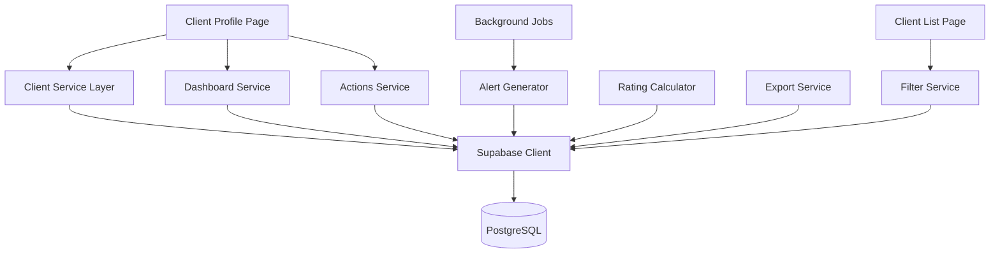
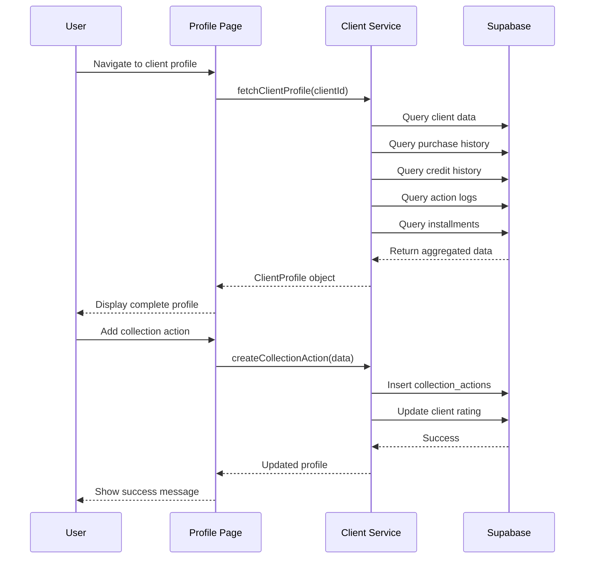

# Design Document: Gestión Avanzada de Clientes (CRM)

## Overview

Este documento define el diseño técnico para extender el sistema de gestión de clientes existente con capacidades avanzadas de CRM. El sistema agregará seguimiento completo del ciclo de vida del cliente, gestión de cobranzas, alertas automáticas, calificación de clientes y análisis de comportamiento. La implementación se basa en Next.js 14 con App Router, Supabase (PostgreSQL), TypeScript y Shadcn/ui.

## Architecture



## Main Workflow: Client Profile View



## Database Schema Extensions

### New Tables

```typescript
// client_deactivations table
interface ClientDeactivation {
  id: string
  client_id: string
  reason: 'FALLECIDO' | 'MUDADO' | 'DESAPARECIDO' | 'OTRO'
  notes: string | null
  deactivated_by: string // user_id
  deactivated_at: Date
  created_at: Date
}

// client_action_logs table
interface ClientActionLog {
  id: string
  client_id: string
  action_type: 'NOTA' | 'LLAMADA' | 'VISITA' | 'MENSAJE' | 'REACTIVACION'
  description: string
  user_id: string
  created_at: Date
}

// client_ratings table (materialized view or computed)
interface ClientRating {
  client_id: string
  rating: 'A' | 'B' | 'C' | 'D'
  score: number
  payment_punctuality: number
  purchase_frequency: number
  total_purchases: number
  client_tenure_days: number
  last_calculated: Date
}

// system_config table
interface SystemConfig {
  key: string
  value: string
  description: string
  updated_at: Date
}
```

### Modified Tables

```typescript
// clients table - add new fields
interface ClientExtended {
  // ... existing fields
  birthday: Date | null
  last_purchase_date: Date | null
  rating: 'A' | 'B' | 'C' | 'D' | null
  rating_score: number | null
  deactivation_reason: string | null
  deactivated_at: Date | null
  deactivated_by: string | null
}
```

## Core Interfaces/Types

```typescript
// Client Profile aggregate
interface ClientProfile {
  client: Client
  creditSummary: CreditSummary
  purchaseHistory: Purchase[]
  creditHistory: CreditPlan[]
  actionLogs: ClientActionLog[]
  collectionActions: CollectionAction[]
  installments: InstallmentWithPlan[]
  rating: ClientRating | null
}

interface CreditSummary {
  creditLimit: number
  creditUsed: number
  creditAvailable: number
  totalDebt: number
  overdueDebt: number
  pendingInstallments: number
  overdueInstallments: number
}

interface Purchase {
  id: string
  saleNumber: string
  date: Date
  total: number
  saleType: 'CONTADO' | 'CREDITO'
  paymentStatus: 'PAID' | 'PENDING' | 'PARTIAL'
}

interface InstallmentWithPlan {
  id: string
  planId: string
  installmentNumber: number
  amount: number
  dueDate: Date
  paidAmount: number
  status: 'PENDING' | 'PARTIAL' | 'PAID' | 'OVERDUE'
  paidAt: Date | null
  saleNumber: string
  daysOverdue: number
}

// Dashboard metrics
interface DashboardMetrics {
  totalActiveClients: number
  totalDeactivatedClients: number
  clientsWithDebt: number
  clientsWithOverdueDebt: number
  inactiveClients: number
  birthdaysThisMonth: number
  pendingCollectionActions: number
  totalOutstandingDebt: number
  totalOverdueDebt: number
}

// Alerts
interface Alert {
  id: string
  type: 'BIRTHDAY' | 'INACTIVITY' | 'INSTALLMENT' | 'OVERDUE'
  clientId: string
  clientName: string
  message: string
  priority: 'HIGH' | 'MEDIUM' | 'LOW'
  dueDate: Date | null
  amount: number | null
  createdAt: Date
}

// Filters
interface ClientFilters {
  debtStatus?: 'AL_DIA' | 'CON_DEUDA' | 'MOROSO'
  daysSinceLastPurchase?: number
  rating?: ('A' | 'B' | 'C' | 'D')[]
  birthdayMonth?: number
  status?: 'ACTIVO' | 'INACTIVO' | 'BAJA'
  deactivationReason?: string[]
}
```

## Key Functions with Formal Specifications

### Function 1: fetchClientProfile()

```typescript
async function fetchClientProfile(clientId: string): Promise<ClientProfile>
```

**Preconditions:**
- `clientId` is a valid UUID
- Client exists in database

**Postconditions:**
- Returns complete ClientProfile object
- All related data is fetched in parallel for performance
- Installments are sorted by due date (earliest first)
- Purchase history is sorted by date (most recent first)
- Days overdue calculated for each installment

**Implementation Notes:**
- Use Promise.all() for parallel queries
- Calculate derived fields (daysOverdue, creditAvailable)
- Handle missing data gracefully (null checks)

### Function 2: calculateClientRating()

```typescript
async function calculateClientRating(clientId: string): Promise<ClientRating>
```

**Preconditions:**
- `clientId` is valid
- Client has at least one purchase or credit plan

**Postconditions:**
- Returns ClientRating with score 0-100
- Rating category assigned: A (90-100), B (70-89), C (50-69), D (0-49)
- All component scores calculated and stored

**Algorithm Components:**
1. Payment Punctuality (40%): Percentage of installments paid on/before due date
2. Purchase Frequency (30%): Purchases per month normalized to 0-100
3. Total Purchase Amount (20%): Total spent normalized to 0-100
4. Client Tenure (10%): Days since first purchase normalized to 0-100

### Function 3: generateAlerts()

```typescript
async function generateAlerts(): Promise<Alert[]>
```

**Preconditions:**
- System config values are set (thresholds)
- Database is accessible

**Postconditions:**
- Returns array of all active alerts
- Alerts are prioritized (HIGH, MEDIUM, LOW)
- No duplicate alerts for same client/type/date

**Alert Types:**
1. Birthday: 7 days before birthday (MEDIUM)
2. Inactivity: No purchases > threshold days (LOW)
3. Installment Due: 7 days before due date (MEDIUM)
4. Overdue: Any overdue installment (HIGH)

### Function 4: deactivateClient()

```typescript
async function deactivateClient(
  clientId: string,
  reason: DeactivationReason,
  notes: string | null,
  userId: string
): Promise<void>
```

**Preconditions:**
- `clientId` is valid and client is active
- `reason` is one of: FALLECIDO, MUDADO, DESAPARECIDO, OTRO
- `userId` is valid user performing action

**Postconditions:**
- Client marked as inactive (active = false)
- Deactivation record created in client_deactivations
- Client cannot make new purchases
- Historical data preserved
- Audit log entry created

### Function 5: filterClients()

```typescript
async function filterClients(filters: ClientFilters): Promise<Client[]>
```

**Preconditions:**
- Filters object is well-formed
- Numeric values are positive

**Postconditions:**
- Returns clients matching ALL applied filters (AND logic)
- Results sorted by name
- Includes computed fields (days since last purchase, debt status)

**Filter Logic:**
- `debtStatus = 'MOROSO'`: At least one overdue installment
- `debtStatus = 'CON_DEUDA'`: credit_used > 0
- `debtStatus = 'AL_DIA'`: credit_used > 0 AND no overdue installments
- `daysSinceLastPurchase`: NOW() - last_purchase_date > threshold
- `status = 'BAJA'`: active = false

## Algorithmic Pseudocode

### Main Algorithm: Calculate Client Rating

```typescript
async function calculateClientRating(clientId: string): Promise<ClientRating> {
  // Step 1: Fetch all required data
  const [installments, purchases, client] = await Promise.all([
    fetchClientInstallments(clientId),
    fetchClientPurchases(clientId),
    fetchClient(clientId)
  ])
  
  // Step 2: Calculate payment punctuality (40% weight)
  let paidOnTime = 0
  let totalPaid = 0
  
  for (const inst of installments) {
    if (inst.status === 'PAID' || inst.status === 'PARTIAL') {
      totalPaid++
      const daysDiff = differenceInDays(inst.paidAt, inst.dueDate)
      if (daysDiff <= 0) {
        paidOnTime++
      }
    }
  }
  
  const punctuality = totalPaid > 0 ? (paidOnTime / totalPaid) * 100 : 50
  
  // Step 3: Calculate purchase frequency (30% weight)
  const firstPurchase = purchases[purchases.length - 1]?.date
  const monthsSinceFirst = firstPurchase 
    ? differenceInMonths(new Date(), firstPurchase)
    : 1
  
  const purchasesPerMonth = purchases.length / Math.max(monthsSinceFirst, 1)
  const frequencyScore = Math.min(purchasesPerMonth * 20, 100) // 5 purchases/month = 100
  
  // Step 4: Calculate total purchase amount (20% weight)
  const totalSpent = purchases.reduce((sum, p) => sum + p.total, 0)
  const amountScore = Math.min(totalSpent / 100, 100) // $10,000 = 100
  
  // Step 5: Calculate client tenure (10% weight)
  const tenureDays = firstPurchase
    ? differenceInDays(new Date(), firstPurchase)
    : 0
  const tenureScore = Math.min(tenureDays / 3.65, 100) // 365 days = 100
  
  // Step 6: Calculate weighted final score
  const finalScore = 
    (punctuality * 0.4) +
    (frequencyScore * 0.3) +
    (amountScore * 0.2) +
    (tenureScore * 0.1)
  
  // Step 7: Assign rating category
  let rating: 'A' | 'B' | 'C' | 'D'
  if (finalScore >= 90) rating = 'A'
  else if (finalScore >= 70) rating = 'B'
  else if (finalScore >= 50) rating = 'C'
  else rating = 'D'
  
  // Step 8: Return rating object
  return {
    client_id: clientId,
    rating,
    score: Math.round(finalScore),
    payment_punctuality: Math.round(punctuality),
    purchase_frequency: Math.round(frequencyScore),
    total_purchases: purchases.length,
    client_tenure_days: tenureDays,
    last_calculated: new Date()
  }
}
```

**Preconditions:**
- clientId is valid UUID
- Client has at least one purchase
- All installments have valid dates

**Postconditions:**
- Returns ClientRating with score 0-100
- Rating category correctly assigned based on score
- All component scores are between 0-100
- last_calculated is current timestamp

**Loop Invariants:**
- For installment loop: paidOnTime <= totalPaid
- All scores remain between 0-100 throughout calculation

### Algorithm: Generate Alerts

```typescript
async function generateAlerts(): Promise<Alert[]> {
  const alerts: Alert[] = []
  const config = await fetchSystemConfig()
  const today = new Date()
  
  // Step 1: Birthday alerts (7 days before)
  const birthdayClients = await supabase
    .from('clients')
    .select('*')
    .eq('active', true)
    .not('birthday', 'is', null)
  
  for (const client of birthdayClients.data || []) {
    const birthday = new Date(client.birthday)
    const nextBirthday = new Date(today.getFullYear(), birthday.getMonth(), birthday.getDate())
    
    if (nextBirthday < today) {
      nextBirthday.setFullYear(today.getFullYear() + 1)
    }
    
    const daysUntil = differenceInDays(nextBirthday, today)
    
    if (daysUntil >= 0 && daysUntil <= 7) {
      alerts.push({
        id: `birthday-${client.id}`,
        type: 'BIRTHDAY',
        clientId: client.id,
        clientName: client.name,
        message: `Cumpleaños en ${daysUntil} días`,
        priority: 'MEDIUM',
        dueDate: nextBirthday,
        amount: null,
        createdAt: today
      })
    }
  }
  
  // Step 2: Inactivity alerts
  const inactivityThreshold = parseInt(config.inactivity_threshold_days || '90')
  const inactiveClients = await supabase
    .from('clients')
    .select('*')
    .eq('active', true)
    .not('last_purchase_date', 'is', null)
  
  for (const client of inactiveClients.data || []) {
    const daysSince = differenceInDays(today, new Date(client.last_purchase_date))
    
    if (daysSince > inactivityThreshold) {
      alerts.push({
        id: `inactivity-${client.id}`,
        type: 'INACTIVITY',
        clientId: client.id,
        clientName: client.name,
        message: `Sin compras hace ${daysSince} días`,
        priority: 'LOW',
        dueDate: null,
        amount: null,
        createdAt: today
      })
    }
  }
  
  // Step 3: Installment due alerts (7 days before)
  const upcomingInstallments = await supabase
    .from('installments')
    .select(`
      *,
      credit_plans!inner(client_id, clients!inner(name))
    `)
    .in('status', ['PENDING', 'PARTIAL'])
    .gte('due_date', today.toISOString())
    .lte('due_date', addDays(today, 7).toISOString())
  
  for (const inst of upcomingInstallments.data || []) {
    const daysUntil = differenceInDays(new Date(inst.due_date), today)
    
    alerts.push({
      id: `installment-${inst.id}`,
      type: 'INSTALLMENT',
      clientId: inst.credit_plans.client_id,
      clientName: inst.credit_plans.clients.name,
      message: `Cuota vence en ${daysUntil} días`,
      priority: 'MEDIUM',
      dueDate: new Date(inst.due_date),
      amount: inst.amount - inst.paid_amount,
      createdAt: today
    })
  }
  
  // Step 4: Overdue alerts
  const overdueInstallments = await supabase
    .from('installments')
    .select(`
      *,
      credit_plans!inner(client_id, clients!inner(name))
    `)
    .in('status', ['PENDING', 'PARTIAL', 'OVERDUE'])
    .lt('due_date', today.toISOString())
  
  for (const inst of overdueInstallments.data || []) {
    const daysOverdue = differenceInDays(today, new Date(inst.due_date))
    
    alerts.push({
      id: `overdue-${inst.id}`,
      type: 'OVERDUE',
      clientId: inst.credit_plans.client_id,
      clientName: inst.credit_plans.clients.name,
      message: `Cuota vencida hace ${daysOverdue} días`,
      priority: 'HIGH',
      dueDate: new Date(inst.due_date),
      amount: inst.amount - inst.paid_amount,
      createdAt: today
    })
  }
  
  return alerts
}
```

**Preconditions:**
- System config is accessible
- Database contains valid date fields
- All clients have valid IDs

**Postconditions:**
- Returns array of all active alerts
- No duplicate alerts (unique by id)
- Alerts sorted by priority (HIGH > MEDIUM > LOW)
- All date calculations are accurate

**Loop Invariants:**
- alerts array only contains valid Alert objects
- All dates are valid Date objects
- Priority values are only HIGH, MEDIUM, or LOW

## Component Architecture

### Page Components

```typescript
// app/(auth)/clients/[id]/page.tsx
export default async function ClientProfilePage({ params }: { params: { id: string } }) {
  const profile = await fetchClientProfile(params.id)
  
  return (
    <div className="container mx-auto py-6">
      <ClientProfileView profile={profile} />
    </div>
  )
}

// app/(auth)/clients/dashboard/page.tsx
export default async function ClientDashboardPage() {
  const [metrics, alerts] = await Promise.all([
    fetchDashboardMetrics(),
    generateAlerts()
  ])
  
  return (
    <div className="container mx-auto py-6">
      <DashboardMetrics metrics={metrics} />
      <AlertsList alerts={alerts} />
    </div>
  )
}
```

### Client Components

```typescript
// components/clients/client-profile-view.tsx
'use client'

export function ClientProfileView({ profile }: { profile: ClientProfile }) {
  const [activeTab, setActiveTab] = useState('overview')
  
  return (
    <div className="space-y-6">
      <ClientHeader client={profile.client} rating={profile.rating} />
      
      <Tabs value={activeTab} onValueChange={setActiveTab}>
        <TabsList>
          <TabsTrigger value="overview">Resumen</TabsTrigger>
          <TabsTrigger value="purchases">Compras</TabsTrigger>
          <TabsTrigger value="credits">Créditos</TabsTrigger>
          <TabsTrigger value="actions">Acciones</TabsTrigger>
        </TabsList>
        
        <TabsContent value="overview">
          <CreditSummaryCard summary={profile.creditSummary} />
          <InstallmentsTable installments={profile.installments} />
        </TabsContent>
        
        <TabsContent value="purchases">
          <PurchaseHistoryTable purchases={profile.purchaseHistory} />
        </TabsContent>
        
        <TabsContent value="credits">
          <CreditHistoryTable credits={profile.creditHistory} />
        </TabsContent>
        
        <TabsContent value="actions">
          <ActionLogsTable logs={profile.actionLogs} />
          <CollectionActionsTable actions={profile.collectionActions} />
          <AddActionForm clientId={profile.client.id} />
        </TabsContent>
      </Tabs>
    </div>
  )
}

// components/clients/client-filters.tsx
'use client'

export function ClientFilters({ onFilterChange }: { onFilterChange: (filters: ClientFilters) => void }) {
  const [filters, setFilters] = useState<ClientFilters>({})
  
  return (
    <div className="grid grid-cols-1 md:grid-cols-3 gap-4">
      <Select
        value={filters.debtStatus}
        onValueChange={(value) => {
          const newFilters = { ...filters, debtStatus: value }
          setFilters(newFilters)
          onFilterChange(newFilters)
        }}
      >
        <SelectTrigger>
          <SelectValue placeholder="Estado de deuda" />
        </SelectTrigger>
        <SelectContent>
          <SelectItem value="AL_DIA">Al día</SelectItem>
          <SelectItem value="CON_DEUDA">Con deuda</SelectItem>
          <SelectItem value="MOROSO">Moroso</SelectItem>
        </SelectContent>
      </Select>
      
      <Select
        value={filters.rating?.join(',')}
        onValueChange={(value) => {
          const newFilters = { ...filters, rating: value.split(',') as ('A' | 'B' | 'C' | 'D')[] }
          setFilters(newFilters)
          onFilterChange(newFilters)
        }}
      >
        <SelectTrigger>
          <SelectValue placeholder="Calificación" />
        </SelectTrigger>
        <SelectContent>
          <SelectItem value="A">A - Excelente</SelectItem>
          <SelectItem value="B">B - Bueno</SelectItem>
          <SelectItem value="C">C - Regular</SelectItem>
          <SelectItem value="D">D - Malo</SelectItem>
        </SelectContent>
      </Select>
      
      <Input
        type="number"
        placeholder="Días sin comprar"
        value={filters.daysSinceLastPurchase || ''}
        onChange={(e) => {
          const newFilters = { ...filters, daysSinceLastPurchase: parseInt(e.target.value) }
          setFilters(newFilters)
          onFilterChange(newFilters)
        }}
      />
    </div>
  )
}
```

## Example Usage

```typescript
// Example 1: Fetch and display client profile
const profile = await fetchClientProfile('client-uuid-123')
console.log(`Client: ${profile.client.name}`)
console.log(`Rating: ${profile.rating?.rating} (${profile.rating?.score}/100)`)
console.log(`Overdue debt: $${profile.creditSummary.overdueDebt}`)

// Example 2: Calculate rating for a client
const rating = await calculateClientRating('client-uuid-123')
await supabase
  .from('clients')
  .update({ 
    rating: rating.rating, 
    rating_score: rating.score 
  })
  .eq('id', 'client-uuid-123')

// Example 3: Generate and display alerts
const alerts = await generateAlerts()
const highPriority = alerts.filter(a => a.priority === 'HIGH')
console.log(`${highPriority.length} high priority alerts`)

// Example 4: Deactivate a client
await deactivateClient(
  'client-uuid-123',
  'MUDADO',
  'Se mudó a otra ciudad',
  'user-uuid-456'
)

// Example 5: Filter clients
const filters: ClientFilters = {
  debtStatus: 'MOROSO',
  rating: ['C', 'D'],
  daysSinceLastPurchase: 60
}
const filteredClients = await filterClients(filters)
console.log(`Found ${filteredClients.length} clients matching filters`)

// Example 6: Export filtered clients
const csvData = await exportClients(filters)
downloadFile(csvData, 'clientes-morosos.csv')
```

## Correctness Properties

*Una propiedad es una característica o comportamiento que debe ser verdadero en todas las ejecuciones válidas de un sistema - esencialmente, una declaración formal sobre lo que el sistema debe hacer. Las propiedades sirven como puente entre las especificaciones legibles por humanos y las garantías de corrección verificables por máquina.*

### Property 1: Rating Score Range Invariant

*For any* client in the system, when the rating is calculated, the score must be between 0 and 100 inclusive.

**Validates: Requirements 2.1**

### Property 2: Rating Category Assignment

*For any* calculated rating score, the assigned category must be 'A' if score >= 90, 'B' if score >= 70, 'C' if score >= 50, or 'D' if score < 50.

**Validates: Requirements 2.6, 2.7, 2.8, 2.9**

### Property 3: Credit Available Calculation

*For any* client with credit information, the available credit must equal credit limit minus credit used.

**Validates: Requirements 10.4**

### Property 4: Credit Limit Enforcement

*For any* active client attempting a credit purchase, if credit used plus purchase amount exceeds credit limit, the purchase must be rejected.

**Validates: Requirements 10.1, 10.2**

### Property 5: Deactivated Clients Cannot Purchase

*For any* client with active = false, any attempt to create a purchase must be rejected by the system.

**Validates: Requirements 4.4**

### Property 6: Alert Generation Idempotence

*For any* specific date, generating alerts multiple times must produce the same set of alerts (same IDs, types, clients, and messages).

**Validates: Requirements 3.7**

### Property 7: Overdue Alert Generation

*For any* installment with due date before current date and status PENDING, PARTIAL, or OVERDUE, the alert generation must include an OVERDUE alert for that installment.

**Validates: Requirements 3.5**

### Property 8: Birthday Alert Generation

*For any* active client with a birthday between 0 and 7 days in the future, the alert generation must include a BIRTHDAY alert for that client.

**Validates: Requirements 3.2**

### Property 9: Filter Results Match All Criteria

*For any* set of filter criteria and any client in the filtered results, that client must satisfy ALL specified filter conditions (AND logic).

**Validates: Requirements 5.1**

### Property 10: Deactivation Preserves History

*For any* client that is deactivated, all historical data (purchases, credit plans, installments, action logs) must remain accessible and unchanged after deactivation.

**Validates: Requirements 4.5**

### Property 11: Deactivation Creates Audit Record

*For any* client deactivation operation, a record must be created in client_deactivations table with reason, notes, user ID, and timestamp.

**Validates: Requirements 4.2, 4.6**

### Property 12: Profile Data Completeness

*For any* valid client ID, fetching the client profile must return an object containing all required fields: client data, credit summary, purchase history, credit history, action logs, collection actions, installments, and rating.

**Validates: Requirements 1.1**

### Property 13: Installments Ordered by Due Date

*For any* client profile, the installments array must be sorted by due date in ascending order (earliest first).

**Validates: Requirements 1.3**

### Property 14: Purchase History Ordered by Date

*For any* client profile, the purchase history array must be sorted by date in descending order (most recent first).

**Validates: Requirements 1.4**

### Property 15: Dashboard Metrics Accuracy

*For any* set of clients in the database, the dashboard total active clients count must equal the number of clients with active = true.

**Validates: Requirements 6.1**

### Property 16: Overdue Debt Calculation

*For any* set of installments in the database, the total overdue debt must equal the sum of (amount - paid_amount) for all installments with due_date < current_date and status not PAID.

**Validates: Requirements 6.9**

### Property 17: Action Log Timestamp Presence

*For any* created action log, the record must include a valid user_id and a created_at timestamp equal to the current date and time.

**Validates: Requirements 7.3**

### Property 18: Reactivation Changes Status

*For any* inactive client, creating an action log with type REACTIVACION must change the client's active status to true.

**Validates: Requirements 7.5**

### Property 19: Export Contains All Filtered Clients

*For any* set of filter criteria, the generated CSV export must contain exactly the clients that match those criteria and no others.

**Validates: Requirements 9.1**

### Property 20: Export Column Completeness

*For any* generated CSV export, each row must contain all required columns: name, DNI, phone, address, credit limit, credit used, total debt, overdue debt, rating, last purchase, and status.

**Validates: Requirements 9.2**

### Property 21: Days Overdue Calculation

*For any* installment with due_date before current date, the calculated days overdue must equal the difference in days between current date and due_date.

**Validates: Requirements 11.1**

### Property 22: Filtered Results Alphabetical Order

*For any* set of filtered clients, the results must be sorted alphabetically by client name in ascending order.

**Validates: Requirements 5.10**

### Property 23: Alert Uniqueness

*For any* generated set of alerts, no two alerts should have the same ID (alerts are unique by type and entity).

**Validates: Requirements 3.8**

### Property 24: Valid Deactivation Reasons

*For any* client deactivation operation, the reason must be one of: FALLECIDO, MUDADO, DESAPARECIDO, or OTRO; any other value must be rejected.

**Validates: Requirements 4.3**

### Property 25: Pagination Limit Enforcement

*For any* client list query without explicit pagination parameters, the returned results must not exceed 100 records.

**Validates: Requirements 14.5**

### Property 26: Rating Calculation Timestamp

*For any* calculated client rating, the last_calculated field must be present and contain a valid timestamp.

**Validates: Requirements 2.11**

### Property 27: Collection Action Required Fields

*For any* created collection action, the record must include client_id, action_type, description, and follow_up_date; records missing any of these fields must be rejected.

**Validates: Requirements 8.1**

### Property 28: Completed Action Timestamp

*For any* collection action marked as completed, the completed_at field must be set to the current timestamp.

**Validates: Requirements 8.4**

### Property 29: Authorization Role Verification

*For any* user attempting to access CRM functions, the system must verify the user has role 'admin' or 'vendedor'; users without these roles must receive a 403 error.

**Validates: Requirements 13.1, 13.2**

### Property 30: Admin-Only Deactivation

*For any* user attempting to deactivate a client, the system must verify the user has role 'admin'; users without this role must be denied.

**Validates: Requirements 13.3**

## Error Handling

### Error Scenario 1: Client Not Found

**Condition**: User attempts to access profile for non-existent client ID
**Response**: Return 404 error with message "Cliente no encontrado"
**Recovery**: Redirect to clients list page

### Error Scenario 2: Invalid Rating Calculation

**Condition**: Client has no purchases or installments
**Response**: Assign default rating 'C' with score 50
**Recovery**: Log warning, continue with default values

### Error Scenario 3: Database Connection Failure

**Condition**: Supabase query fails due to network/connection issue
**Response**: Show error toast "Error de conexión. Intente nuevamente."
**Recovery**: Retry query up to 3 times with exponential backoff

### Error Scenario 4: Invalid Filter Values

**Condition**: User provides negative numbers or invalid enum values
**Response**: Validate inputs, show validation error messages
**Recovery**: Reset invalid filters to default values

## Testing Strategy

### Unit Testing Approach

Test individual functions in isolation using Jest:

1. **calculateClientRating()**: Test with various client scenarios (new client, excellent payer, poor payer, no history)
2. **generateAlerts()**: Test each alert type independently with mocked dates
3. **filterClients()**: Test each filter criterion and combinations
4. **deactivateClient()**: Test state transitions and data preservation

Coverage goal: 90% for business logic functions

### Property-Based Testing Approach

**Property Test Library**: fast-check (TypeScript)

**Properties to Test**:
1. Rating score always in range [0, 100]
2. Alert generation is deterministic for same date
3. Filter combinations always return subset of all clients
4. Credit calculations never produce negative values
5. Date calculations handle edge cases (leap years, month boundaries)

### Integration Testing Approach

Test complete workflows with test database:

1. Create client → Add purchases → Calculate rating → Verify score
2. Create credit plan → Generate alerts → Verify alert types
3. Apply filters → Export data → Verify CSV format
4. Deactivate client → Attempt purchase → Verify rejection

## Performance Considerations

1. **Parallel Queries**: Use Promise.all() to fetch related data simultaneously
2. **Pagination**: Limit initial client list to 100 records, implement infinite scroll
3. **Indexing**: Add database indexes on:
   - clients.last_purchase_date
   - clients.rating
   - installments.due_date
   - installments.status
4. **Caching**: Cache dashboard metrics for 5 minutes using React Query
5. **Debouncing**: Debounce filter changes (300ms) to reduce query frequency
6. **Materialized Views**: Consider materialized view for client_ratings table, refresh nightly

## Security Considerations

1. **Authorization**: Verify user has 'admin' or 'vendedor' role before accessing CRM features
2. **Row-Level Security**: Implement RLS policies in Supabase to restrict data access by store
3. **Input Validation**: Validate all user inputs on both client and server side
4. **Audit Trail**: Log all deactivation and rating changes in audit_log table
5. **Data Privacy**: Mask sensitive client data (DNI, phone) in exports unless user has 'admin' role
6. **SQL Injection**: Use parameterized queries (Supabase client handles this)

## Dependencies

- **Next.js 14**: App Router, Server Components, Server Actions
- **Supabase**: PostgreSQL database, authentication, RLS
- **TypeScript**: Type safety throughout application
- **Shadcn/ui**: UI components (Dialog, Tabs, Select, Table, etc.)
- **Tailwind CSS**: Styling
- **date-fns**: Date manipulation and calculations
- **React Query**: Data fetching and caching (optional)
- **Zod**: Schema validation for forms and API inputs
- **fast-check**: Property-based testing library
